# 循环-for 和数组

# 1. for 循环

## 1.1 for循环-基本使用

### 1.1.1 for循环语法

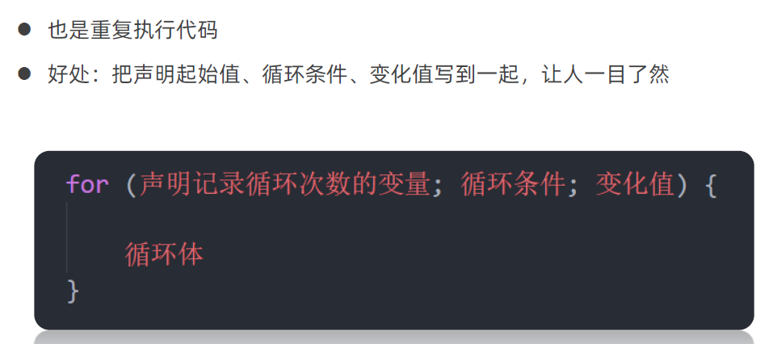

### 1.1.2 循环退出

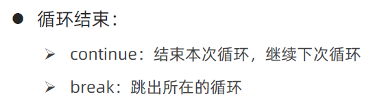

### 1.1.3 for 循环嵌套

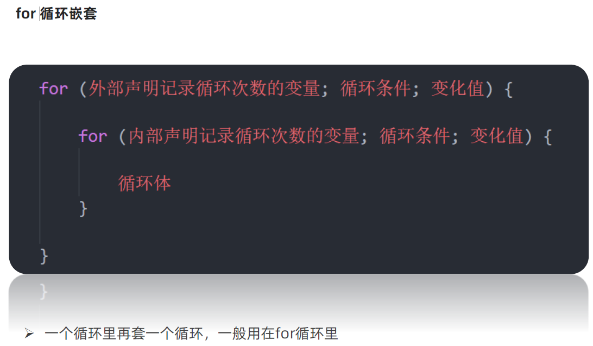

# 2. 数组

## 2.1 数组是什么

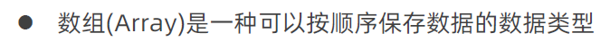

## 2.2 数组的基本使用

### 2.2.1 声明语法

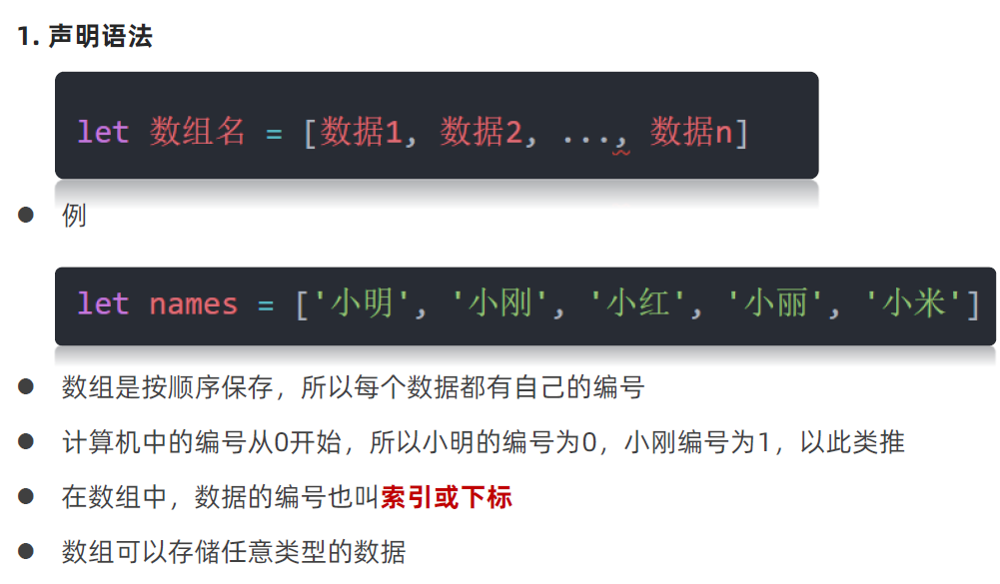

### 2.2.2 取值语法

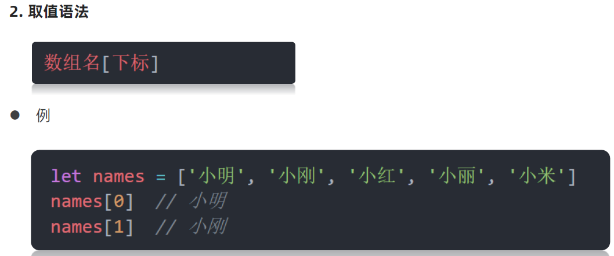

### 2.2.3 一些术语

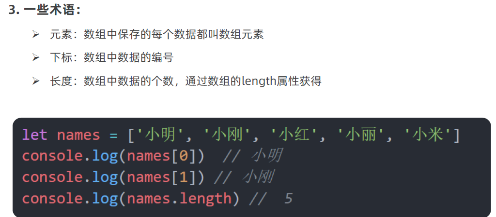

### 2.2.4 遍历数组

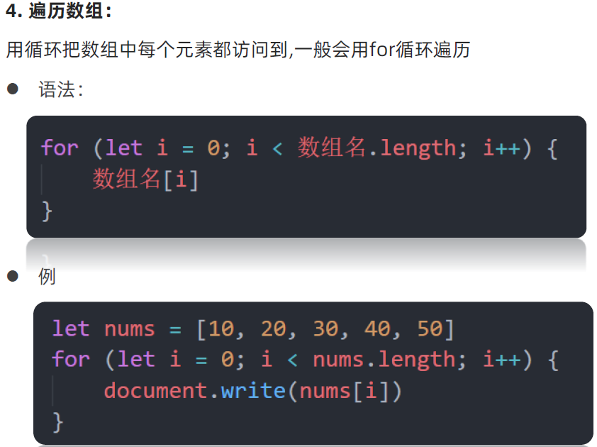

## 2.3 操作数组

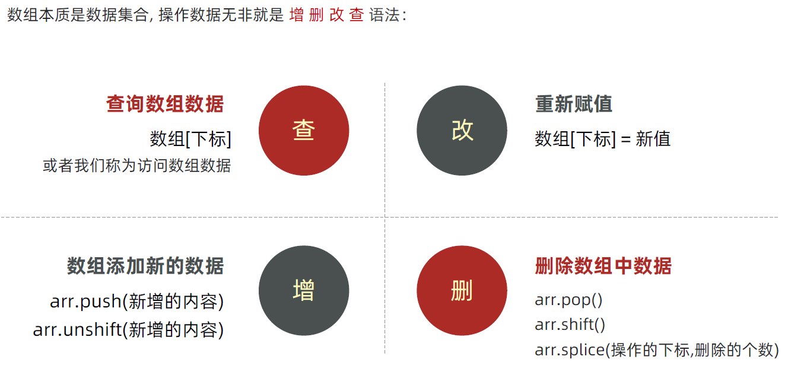

### 2.3.1 数组 增加新的数据 arr.push () arr.unshift ()

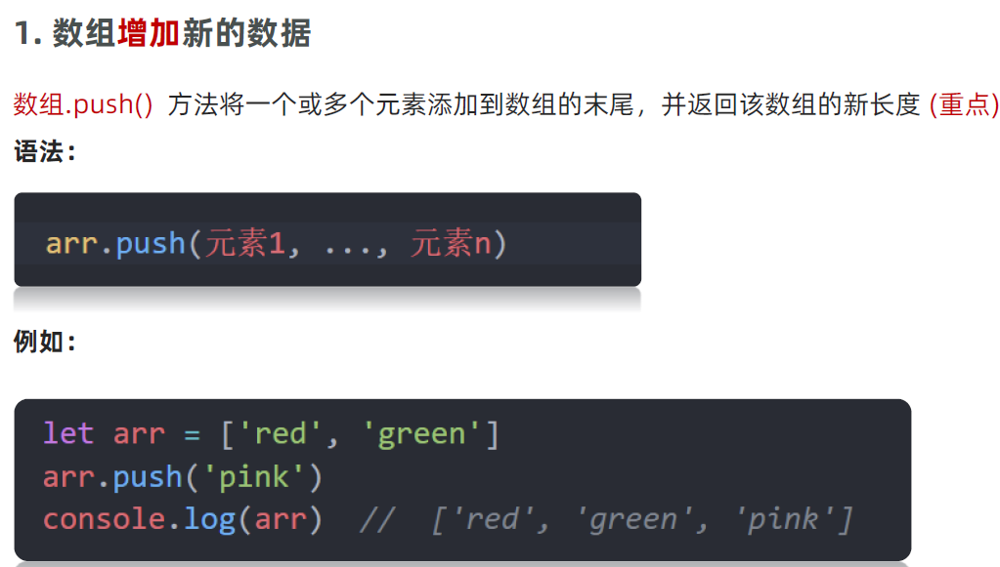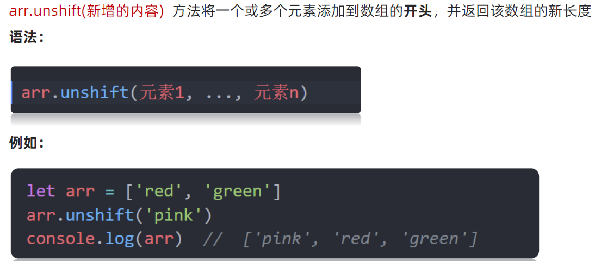

### 2.3.2 数组 删除元素 arr. pop ()  arr.shift ()   arr.splice 起始位置 , 删除的个数 )

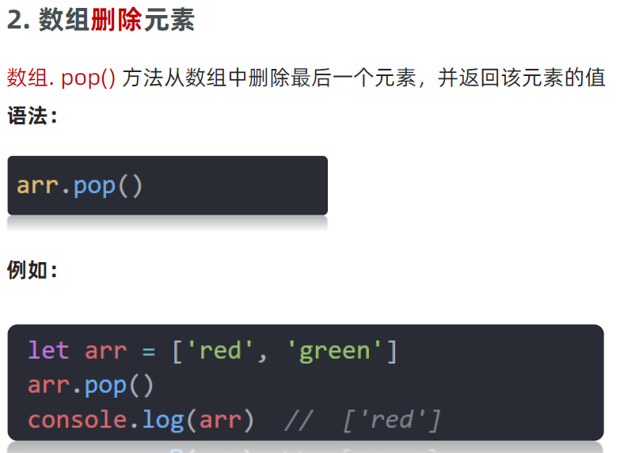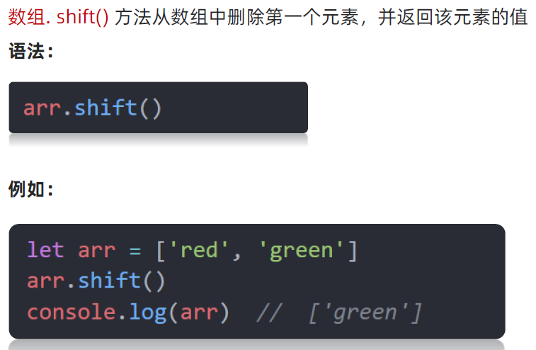


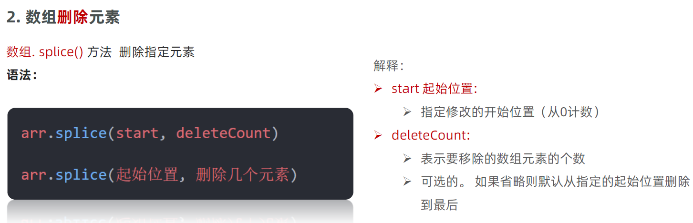

## 2.4 数组案例 冒泡排序

```
var array = [5,1,3,9,4,8,7,0,6,2];
    // 循环的次数
    for (var i = 0 ; i < array.length; i++){
        // 每次循环交换位置的次数
        for (var j = 0; j < i; j++) {
            if (array[j] > array[i]) {
                var temp = array[i];
                array[i] = array[j];
                array[j] = temp;
            }
        }
    }
    console.log(array);
```

