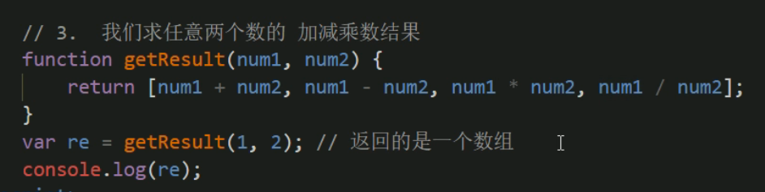

# 函数 function

## 1.1 为什么需要函数

## 1.2 函数使用

### 1.2.1 函数的声明语法

==函数声明有2种方法==

### 1.2.2 函数名命名规范

### 1.2.3 函数的调用语法

### 1.2.4 函数体

## 1.3 函数传参

### 1.3.1 有参数的函数声明和调用

### 1.3.2 有参数的函数声明和调用

### 1.3.3 形参和实参 

### 1.3.4 形参和实参的个数不匹配问题

## 1.4 函数返回值

### 1.4.1 为什么要让函数有返回值

### 1.4.2 用 return 返回数据

==返回多个值,可以使用数组,数组算一个值==

## 1.5 arguments 的使用

## 1.6 作用域

### 1.6.1 作用域 概述  (块级作用域在 es6语法 以后才有)

### 1.6.2 变量的作用域

### 1.6.3  变量访问原则 作用域链

==案列参考==

### 1.6.4  js 预解析

## 1.7 匿名函数

### 1.7.1 匿名函数

### 1.7.2 立即执行函数

