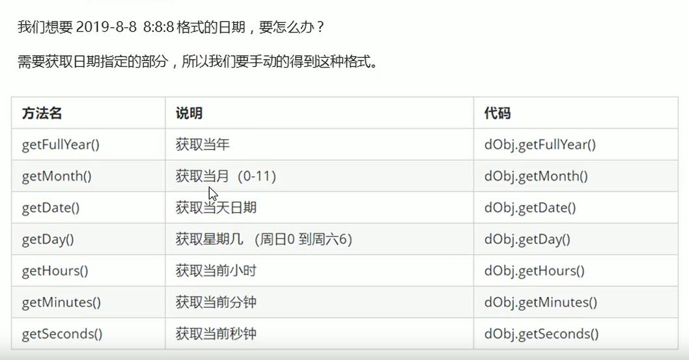
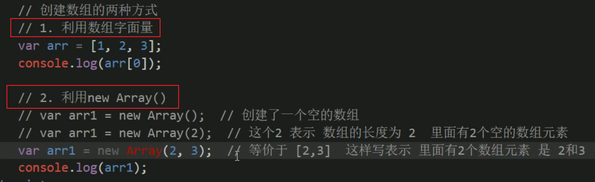

# 1. 对象

## 1.1 对象是什么


## 1.2 对象使用

### 1.2.1 对象声明语法


### 1.2.2 对象 有属性和方法组成


### 1.2.3 属性


### 1.2.4 属性访问  person.name  person['name']


### 1.2.5 对象中的方法


### 1.2.6 对象中的方法访问


## 1.3 操作对象


### 1.3.1 增加属性


### 1.3.2 新增对象中的方法


## 1.4 构造函数

### 1.4.1 构造函数案列


### 1.4.2  new关键字


## 1.5 遍历对象


== == 


# 2.内置对象

## 2.1 含义


## 2.2  参考文档 MDM

https://developer.mozilla.org/zh-CN/

### 2.3 常用内置对象介绍

### 2.3.1  内置对象 Math


#### 2.3.1.1 ==随机数方法 Math.random()==


#### 2.3.1.2 ==随机点名案列==


#### 2.3.1.3   ==猜大小案列==


### 2.3.2 内置对象  日期对象 Date 

#### 2.3.2.1  Date()方法的使用


#### 2.3.2.2 日期格式化



#### 2.3.2.3 三种获取1970年到现在的时间


#### 2.3.2.4 倒计时


### 2.3.3 内置对象  数组对象

#### 2.3.3.1 数组对象创建的两种方式



#### 2.3.3.2 检测是否为数组的两种方式


#### 2.3.3.3 添加或者删除数组的方法


#### 2.3.3.4 数组排序


#### 2.3.3.5 数组索引


##### 2.3.3.5.1==去重案例==


#### 2.3.3.6 数组转化为字符串


#### 2.3.3.7 数组连接和数组截取


### 2.3.4 内置对象  字符串对象 

#### 2.3.4.1  基本包装类型


#### 2.3.4.2  字符串的不可变


#### 2.3.4.3  案例

##### 2.3.4.3.1 ==根据字符串返回位置==


##### 2.3.4.3.2  ==字符串中某个字符出现的次数==


#### ==2.3.4.4 根据位置返回字符(重点)==


##### 2.3.4.4.1 ==统计出现最多次数的案例==

```
var str = 'aadstadsaglmggnasg';
        var o = {};

        for (let i = 0; i < str.length; i++) {
            var chars =  str.charAt(i); //字符串的每个字符
            if (o[chars]) {             //o[chars] 得到的属性值
                o[chars]++;
            }else {
                o[chars] = 1;
            }
        }
        console.log(o);
        //遍历对象
        var max = 0;
        var ch = '';
        // k是属性名 o[k]是属性值
        for (var k in o){
            if (o[k] > max){
                max = o[k];
                ch = k;
            }
        }
        console.log(max);
        console.log('出现最多的字符 ' + ch );
```

#### ==2.3.4.5 字符串拼接和截取(重点)==


#### ==2.3.4.6 字符串替换和转换为数组(重点)==

##### 2.3.4.6.1 字符串替换 replace


##### 2.3.4.6.1 ==字符串转换为数组(常用)==


# 3.拓展 术语 解释

## 3.1 术语


## 3.2 基本数据类型和引用数据类型的存储方式


## 3.3 堆栈空间分配区别


### 2.3.1 简单类型的内存分配


### 2.3.2 复杂类型的内存分配

