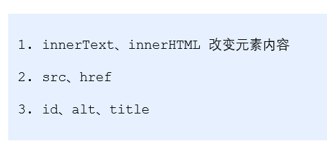
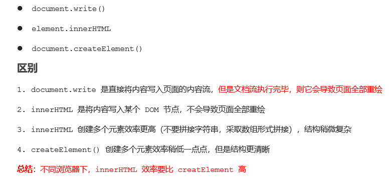

# DOM

# 1. DOM 简介

## 1.1 什么是DOM


## **1.2 DOM** **树**


# 2.获取元素

## **2.1** **如何获取**页面元素


## **2.2** **根据** **ID** **获取**


## **2.3** **根据 **标签名 获取


## **2.4** **通过** **HTML5** **新增的方法获取**


## **2.5** **获取** 特殊元素（**body**，**html**）


# 3.事件基础

## **3.1** **事件概述**


## **3.2** **事件三要素**


## **3.3** **执行事件的步骤**


## ==3.4 **常见的鼠标事件**==


# 4.操作元素

## **4.1** **改变元素内容** innerText innerHtml


## **4.2** **常用元素的属性操作**




## **4.3** **表单元素的属性操作**


## **4.4** **样式属性操作**


## 4.5 **操作**元素总结


## 4.6 **排他思想**


## 4.7 **自定义属性的操作**


## 4.8 **H5**自定义属性(规范用 data- 开头)


# 5.节点操作

## **5.1** **为什么学节点操作**


## **5.2** **节点概述**


## **5.3** **节点**层级


### 5.3.1 父级节点 parentNode


### 5.3.2 子节点  


==建议使用这种方式==


==所有节点的第一个==


==元素节点的第一个==


==获取节点的第一个最好的方法==


### 5.3.3 兄弟节点 


```
function getNextElementSibling(element) {
      var el = element;
      while (el = el.nextSibling) {
        if (el.nodeType === 1) {
            return el;
        }
      }
      return null;
    }  
```

### 5.3.4 **创建节点**


### 5.3.5 添加**节点**


==简单留言板案列==


### 5.3.6 **删除节点**


### 5.3.7 **复制节点**(**克隆节点**)


### 5.3.8 **三**种动态创建元素区别



# 6.==DOM 重点核心==

## **6.1** **创建**


## **6.2** *增*


## **6.3** **删**


## **6.4** **改**


## **6.5** **查**


## **6.6** **属性**操作


## **6.7** **事件操作**

