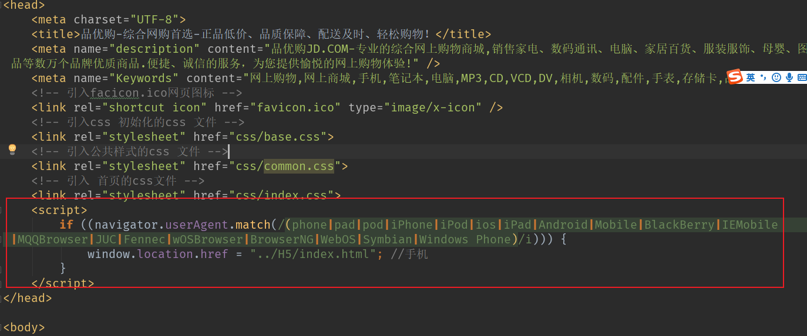

# **BOM** **浏览器对象模型**

# 1.BOM 概述

## **1.1** **什么是** **BOM** 


## **1.2 BOM** 的构成


# 2. window 对象的常见事件

## **2.1** **窗口加载事件** 


## **2.2** **调整窗口大小事件**


## 2.3 定时器

## **3.1** **两种定时器**


## **3.2** **setTimeout**() **定时器**


## **3.3** **停止** **setTimeout**() **定时器**


## **3.4** **setInterval**() **定时器**


## **3.5** **停止** **setInterval**() **定时器**


### 3.5.1 ==发送短信案列==


## **3.6 this**


```
<!DOCTYPE html>
<html lang="en">

<head>
    <meta charset="UTF-8">
    <meta name="viewport" content="width=device-width, initial-scale=1.0">
    <meta http-equiv="X-UA-Compatible" content="ie=edge">
    <title>Document</title>
</head>

<body>
    <button>点击</button>
    <script>
        // this 指向问题 一般情况下this的最终指向的是那个调用它的对象

        // 1. 全局作用域或者普通函数中this指向全局对象window（ 注意定时器里面的this指向window）
        console.log(this);

        function fn() {
            console.log(this);

        }
        window.fn();
        window.setTimeout(function() {
            console.log(this);

        }, 1000);
        // 2. 方法调用中谁调用this指向谁
        var o = {
            sayHi: function() {
                console.log(this); // this指向的是 o 这个对象

            }
        }
        o.sayHi();
        var btn = document.querySelector('button');
        // btn.onclick = function() {
        //     console.log(this); // this指向的是btn这个按钮对象

        // }
        btn.addEventListener('click', function() {
                console.log(this); // this指向的是btn这个按钮对象

            })
            // 3. 构造函数中this指向构造函数的实例
        function Fun() {
            console.log(this); // this 指向的是fun 实例对象

        }
        var fun = new Fun();
    </script>
</body>

</html>
```

# **4. JS** **执行机制**

## **4.1 JS** **是单线程**


## **4.2** **同步和异步**


## **4.3** **同步任务和异步任务**


## **4.4** **JS** **执行机制**


# **5. location 对象**

## **5.1** **什么是** **location** **对象**


## **5.2 URL**


## **5.3 location** **对象的属性**


### 5.3.1 ==5s秒自动跳案列转==


### 5.3.2 获取url 参数案列


## **5.4 location** **对象的方法**


# **6. navigator 对象**(区分手机电脑)




```
if((navigator.userAgent.match(/(phone|pad|pod|iPhone|iPod|ios|iPad|Android|Mobile|BlackBerry|IEMobile|MQQBrowser|JUC|Fennec|wOSBrowser|BrowserNG|WebOS|Symbian|Windows Phone)/i))) {
    window.location.href = "";     //手机
 } else {
    window.location.href = "";     //电脑
 }
```

# **7. history 对象**


