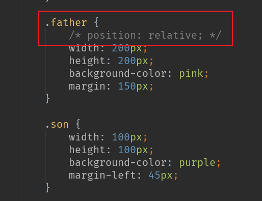
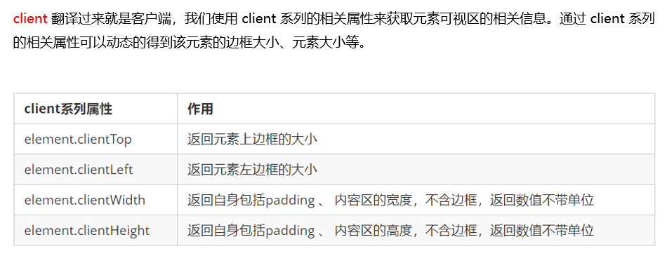
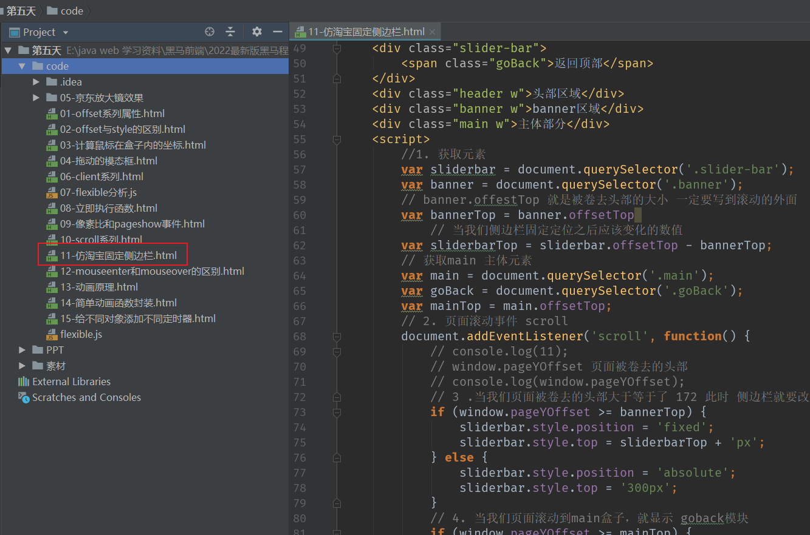
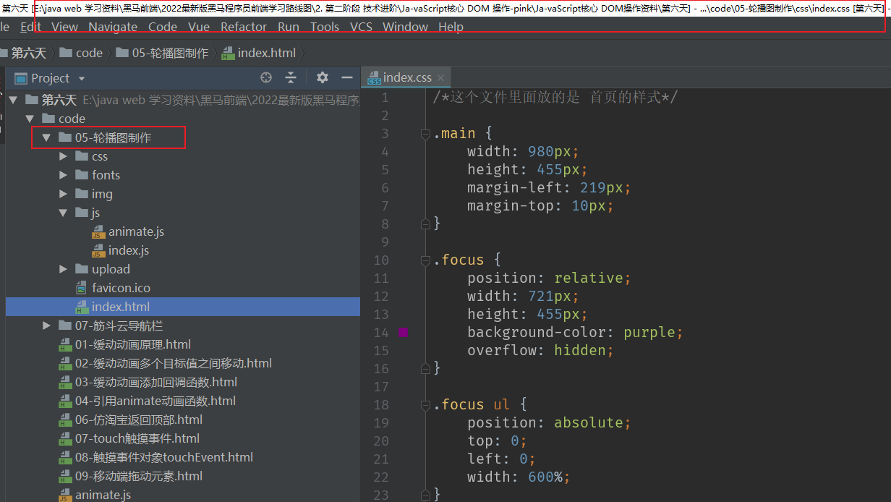

# **PC** **端**网页特效

# 1.元素偏移量 offset 系列

## **1.1** **offset** **概述** 


==距离屏幕左边和上边的数值==


==如果需要知道子元素到父元素的距离,在父元素加上 positon:relative==



## **1.2 offset** **与** **style** **区别** 


## 1.3 案列

### 1.3.1 计算鼠标在盒子中的坐标


### 1.3.2 模块框拖动


```
<!DOCTYPE html>
<html>

<head lang="en">
    <meta charset="UTF-8">
    <title></title>
    <style>
        .login-header {
            width: 100%;
            text-align: center;
            height: 30px;
            font-size: 24px;
            line-height: 30px;
        }
        
        ul,
        li,
        ol,
        dl,
        dt,
        dd,
        div,
        p,
        span,
        h1,
        h2,
        h3,
        h4,
        h5,
        h6,
        a {
            padding: 0px;
            margin: 0px;
        }
        
        .login {
            display: none;
            width: 512px;
            height: 280px;
            position: fixed;
            border: #ebebeb solid 1px;
            left: 50%;
            top: 50%;
            background: #ffffff;
            box-shadow: 0px 0px 20px #ddd;
            z-index: 9999;
            transform: translate(-50%, -50%);
        }
        
        .login-title {
            width: 100%;
            margin: 10px 0px 0px 0px;
            text-align: center;
            line-height: 40px;
            height: 40px;
            font-size: 18px;
            position: relative;
            cursor: move;
        }
        
        .login-input-content {
            margin-top: 20px;
        }
        
        .login-button {
            width: 50%;
            margin: 30px auto 0px auto;
            line-height: 40px;
            font-size: 14px;
            border: #ebebeb 1px solid;
            text-align: center;
        }
        
        .login-bg {
            display: none;
            width: 100%;
            height: 100%;
            position: fixed;
            top: 0px;
            left: 0px;
            background: rgba(0, 0, 0, .3);
        }
        
        a {
            text-decoration: none;
            color: #000000;
        }
        
        .login-button a {
            display: block;
        }
        
        .login-input input.list-input {
            float: left;
            line-height: 35px;
            height: 35px;
            width: 350px;
            border: #ebebeb 1px solid;
            text-indent: 5px;
        }
        
        .login-input {
            overflow: hidden;
            margin: 0px 0px 20px 0px;
        }
        
        .login-input label {
            float: left;
            width: 90px;
            padding-right: 10px;
            text-align: right;
            line-height: 35px;
            height: 35px;
            font-size: 14px;
        }
        
        .login-title span {
            position: absolute;
            font-size: 12px;
            right: -20px;
            top: -30px;
            background: #ffffff;
            border: #ebebeb solid 1px;
            width: 40px;
            height: 40px;
            border-radius: 20px;
        }
    </style>
</head>

<body>
    <div class="login-header"><a id="link" href="javascript:;">点击，弹出登录框</a></div>
    <div id="login" class="login">
        <div id="title" class="login-title">登录会员
            <span><a id="closeBtn" href="javascript:void(0);" class="close-login">关闭</a></span>
        </div>
        <div class="login-input-content">
            <div class="login-input">
                <label>用户名：</label>
                <input type="text" placeholder="请输入用户名" name="info[username]" id="username" class="list-input">
            </div>
            <div class="login-input">
                <label>登录密码：</label>
                <input type="password" placeholder="请输入登录密码" name="info[password]" id="password" class="list-input">
            </div>
        </div>
        <div id="loginBtn" class="login-button"><a href="javascript:void(0);" id="login-button-submit">登录会员</a></div>
    </div>
    <!-- 遮盖层 -->
    <div id="bg" class="login-bg"></div>
    <script>
        // 1. 获取元素
        var login = document.querySelector('.login');
        var mask = document.querySelector('.login-bg');
        var link = document.querySelector('#link');
        var closeBtn = document.querySelector('#closeBtn');
        var title = document.querySelector('#title');
        // 2. 点击弹出层这个链接 link  让mask 和login 显示出来
        link.addEventListener('click', function() {
                mask.style.display = 'block';
                login.style.display = 'block';
            })
            // 3. 点击 closeBtn 就隐藏 mask 和 login 
        closeBtn.addEventListener('click', function() {
                mask.style.display = 'none';
                login.style.display = 'none';
            })
            // 4. 开始拖拽
            // (1) 当我们鼠标按下， 就获得鼠标在盒子内的坐标
        title.addEventListener('mousedown', function(e) {
            var x = e.pageX - login.offsetLeft;
            var y = e.pageY - login.offsetTop;
            // (2) 鼠标移动的时候，把鼠标在页面中的坐标，减去 鼠标在盒子内的坐标就是模态框的left和top值
            document.addEventListener('mousemove', move)

            function move(e) {
                login.style.left = e.pageX - x + 'px';
                login.style.top = e.pageY - y + 'px';
            }
            // (3) 鼠标弹起，就让鼠标移动事件移除
            document.addEventListener('mouseup', function() {
                document.removeEventListener('mousemove', move);
            })
        })
    </script>
</body>

</html>
```

### 1.3.3 京东放大镜效果


# **2.** **元素可视区** **client** **系列**




## 2.1 立即执行函数


## 2.2 ==**flexible.js** 源码==

```
(function flexible(window, document) {
    // 获取的html 的根元素
    var docEl = document.documentElement
        // dpr 物理像素比
    var dpr = window.devicePixelRatio || 1

    // adjust body font size  设置我们body 的字体大小
    function setBodyFontSize() {
        // 如果页面中有body 这个元素 就设置body的字体大小
        if (document.body) {
            document.body.style.fontSize = (12 * dpr) + 'px'
        } else {
            // 如果页面中没有body 这个元素，则等着 我们页面主要的DOM元素加载完毕再去设置body
            // 的字体大小
            document.addEventListener('DOMContentLoaded', setBodyFontSize)
        }
    }
    setBodyFontSize();

    // set 1rem = viewWidth / 10    设置我们html 元素的文字大小
    function setRemUnit() {
        var rem = docEl.clientWidth / 10
        docEl.style.fontSize = rem + 'px'
    }

    setRemUnit()

    // reset rem unit on page resize  当我们页面尺寸大小发生变化的时候，要重新设置下rem 的大小
    window.addEventListener('resize', setRemUnit)
        // pageshow 是我们重新加载页面触发的事件
    window.addEventListener('pageshow', function(e) {
        // e.persisted 返回的是true 就是说如果这个页面是从缓存取过来的页面，也需要从新计算一下rem 的大小
        if (e.persisted) {
            setRemUnit()
        }
    })

    // detect 0.5px supports  有些移动端的浏览器不支持0.5像素的写法
    if (dpr >= 2) {
        var fakeBody = document.createElement('body')
        var testElement = document.createElement('div')
        testElement.style.border = '.5px solid transparent'
        fakeBody.appendChild(testElement)
        docEl.appendChild(fakeBody)
        if (testElement.offsetHeight === 1) {
            docEl.classList.add('hairlines')
        }
        docEl.removeChild(fakeBody)
    }
}(window, document))
```

# **3.** **元素滚动** **scroll** **系列**

## **3.1** **元素** **scroll** **系列**属性


## **3.2** **页面被卷去的头部**


## **3.3** **页面被卷去的****头部兼容性解决方案**


```
function getScroll() {
    return {
      left: window.pageXOffset || document.documentElement.scrollLeft || document.body.scrollLeft||0,
      top: window.pageYOffset || document.documentElement.scrollTop || document.body.scrollTop || 0
    };
 } 
使用的时候  getScroll().left
```

## ==3.4 仿淘宝固定侧边栏案例==




# 4.**三大系列总结**


## 4.1 **m**ouseenter **和**mouseover**的区别**


# **5.** **动画函数封装**

## 5.1 **动画实现原理** 


## **5.2** **动画函数简单封装** 


==封装动画必须要有定位==


==封装动画==


## 5.3 **动画函数给不同元素记录不同定时器** 


## 5.4 **缓**动**效果原理** 


## 5.5 **动画函数多个目标值之间移动** 


## **5.6** **动画函数添加回调函数** 


==callback 就是回调函数案列==

```
<!DOCTYPE html>
<html lang="en">

<head>
    <meta charset="UTF-8">
    <meta name="viewport" content="width=device-width, initial-scale=1.0">
    <meta http-equiv="X-UA-Compatible" content="ie=edge">
    <title>Document</title>
    <style>
        div {
            position: absolute;
            left: 0;
            width: 100px;
            height: 100px;
            background-color: pink;
        }
        
        span {
            position: absolute;
            left: 0;
            top: 200px;
            display: block;
            width: 150px;
            height: 150px;
            background-color: purple;
        }
    </style>
</head>

<body>
    <button class="btn500">点击夏雨荷到500</button>
    <button class="btn800">点击夏雨荷到800</button>
    <span>夏雨荷</span>
    <script>
        // 缓动动画函数封装obj目标对象 target 目标位置
        // 思路：
        // 1. 让盒子每次移动的距离慢慢变小， 速度就会慢慢落下来。
        // 2. 核心算法：(目标值 - 现在的位置) / 10 做为每次移动的距离 步长
        // 3. 停止的条件是： 让当前盒子位置等于目标位置就停止定时器
        function animate(obj, target, callback) {
            // console.log(callback);  callback = function() {}  调用的时候 callback()

            // 先清除以前的定时器，只保留当前的一个定时器执行
            clearInterval(obj.timer);
            obj.timer = setInterval(function() {
                // 步长值写到定时器的里面
                // 把我们步长值改为整数 不要出现小数的问题
                // var step = Math.ceil((target - obj.offsetLeft) / 10);
                var step = (target - obj.offsetLeft) / 10;
                step = step > 0 ? Math.ceil(step) : Math.floor(step);
                if (obj.offsetLeft == target) {
                    // 停止动画 本质是停止定时器
                    clearInterval(obj.timer);
                    // 回调函数写到定时器结束里面
                    if (callback) {
                        // 调用函数
                        callback();
                    }
                }
                // 把每次加1 这个步长值改为一个慢慢变小的值  步长公式：(目标值 - 现在的位置) / 10
                obj.style.left = obj.offsetLeft + step + 'px';

            }, 15);
        }
        var span = document.querySelector('span');
        var btn500 = document.querySelector('.btn500');
        var btn800 = document.querySelector('.btn800');

        btn500.addEventListener('click', function() {
            // 调用函数
            animate(span, 500);
        })
        btn800.addEventListener('click', function() {
                // 调用函数
                animate(span, 800, function() {
                    // alert('你好吗');
                    span.style.backgroundColor = 'red';
                });
            })
            // 匀速动画 就是 盒子是当前的位置 +  固定的值 10 
            // 缓动动画就是  盒子当前的位置 + 变化的值(目标值 - 现在的位置) / 10）
    </script>
</body>

</html>
```

## **5.7** **动画**函数封装到单独**JS**文件里面  animate.js

### 5.7.1 animate.js


```
function animate(obj, target, callback) {
    // console.log(callback);  callback = function() {}  调用的时候 callback()

    // 先清除以前的定时器，只保留当前的一个定时器执行
    clearInterval(obj.timer);
    obj.timer = setInterval(function() {
        // 步长值写到定时器的里面
        // 把我们步长值改为整数 不要出现小数的问题
        // var step = Math.ceil((target - obj.offsetLeft) / 10);
        var step = (target - obj.offsetLeft) / 10;
        step = step > 0 ? Math.ceil(step) : Math.floor(step);
        if (obj.offsetLeft == target) {
            // 停止动画 本质是停止定时器
            clearInterval(obj.timer);
            // 回调函数写到定时器结束里面
            // if (callback) {
            //     // 调用函数
            //     callback();
            // }
            callback && callback();
        }
        // 把每次加1 这个步长值改为一个慢慢变小的值  步长公式：(目标值 - 现在的位置) / 10
        obj.style.left = obj.offsetLeft + step + 'px';

    }, 15);
}
```

### 5.7.2==引入案例展示==

```
<!DOCTYPE html>
<html lang="en">

<head>
    <meta charset="UTF-8">
    <meta name="viewport" content="width=device-width, initial-scale=1.0">
    <meta http-equiv="X-UA-Compatible" content="ie=edge">
    <title>Document</title>
    <style>
        .sliderbar {
            position: fixed;
            right: 0;
            bottom: 100px;
            width: 40px;
            height: 40px;
            text-align: center;
            line-height: 40px;
            cursor: pointer;
            color: #fff;
        }
        
        .con {
            position: absolute;
            left: 0;
            top: 0;
            width: 200px;
            height: 40px;
            background-color: purple;
            z-index: -1;
        }
    </style>
    <script src="animate.js"></script>
</head>

<body>
    <div class="sliderbar">
        <span>←</span>
        <div class="con">问题反馈</div>
    </div>

    <script>
        // 1. 获取元素
        var sliderbar = document.querySelector('.sliderbar');
        var con = document.querySelector('.con');
        // 当我们鼠标经过 sliderbar 就会让 con这个盒子滑动到左侧
        // 当我们鼠标离开 sliderbar 就会让 con这个盒子滑动到右侧
        sliderbar.addEventListener('mouseenter', function() {
            // animate(obj, target, callback);
            animate(con, -160, function() {
                // 当我们动画执行完毕，就把 ← 改为 →
                sliderbar.children[0].innerHTML = '→';
            });
        })
        sliderbar.addEventListener('mouseleave', function() {
            // animate(obj, target, callback);
            animate(con, 0, function() {
                sliderbar.children[0].innerHTML = '←';
            });

        })
    </script>
</body>

</html>
```

### 5.7.3 ==网页轮播图案列及代码位置==


==代码==



# **6. 常见网页特效案例**

## 6.1**节流阀**


## 6.2 带有动画的返回页面顶部案列


### 6.3筋斗云案列

