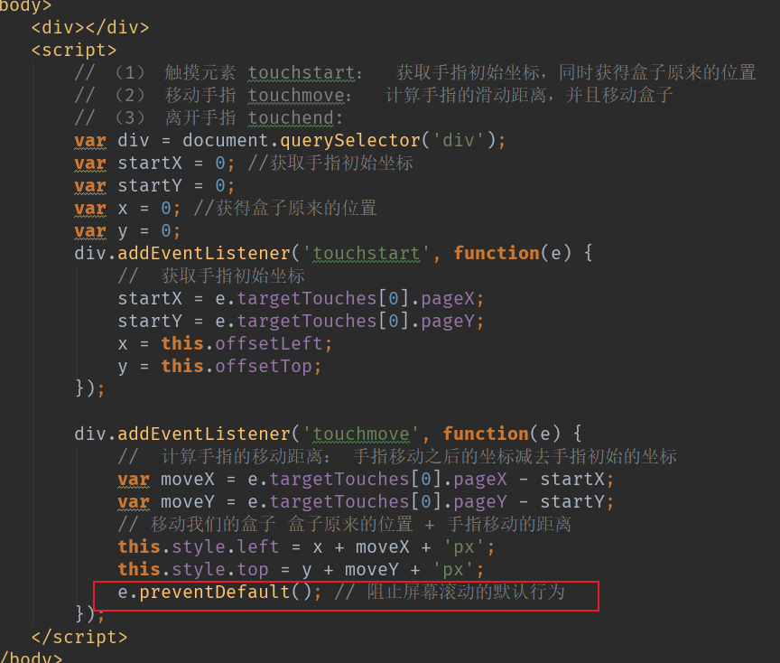

# 立即**移动端**网页特效

# **1.** **触屏事件**

## **1.1** **触**屏事件概述

## **1.2** **触摸事件对象（**T**ouchEvent**）

## **1.3** **移动端拖**动元素

# 2. **移动端常见特效**

## 2.1 移动端轮播图案列

## **2.2 classList **属性

## 2.3  **click** **延时解决**方案

# 3 移动端常用开发插件

## 3.1 **什么是插件**

## 3.2**插件的使用**

## 3.3 **Swiper** **插件的使用**

==中文官网地址：==  https://www.swiper.com.cn/ 

## 3.4 其他**移动端常见插件**

==superslide：==  http://www.superslide2.com/

==iscroll：==  https://github.com/cubiq/iscroll

## 3.5 插件使用总结

## 3.6 **移动**端视频插件 **zy.media.js**

# 4. **移动端常用开发框架**

## **4.1** **框架概述**

## 4.2 **Bootstrap**

## **4.3 MUI** **原生**UI**前端框架**

==MUI 中文官网地址：==http://dev.dcloud.net.cn/mui/