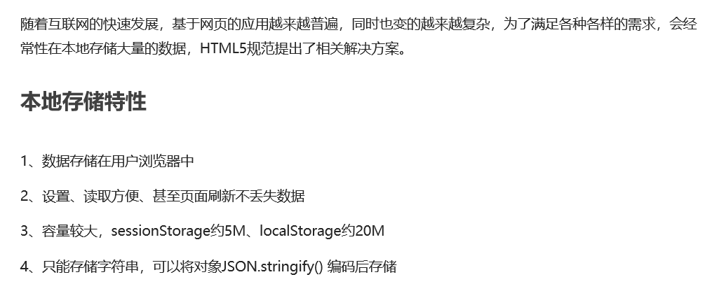
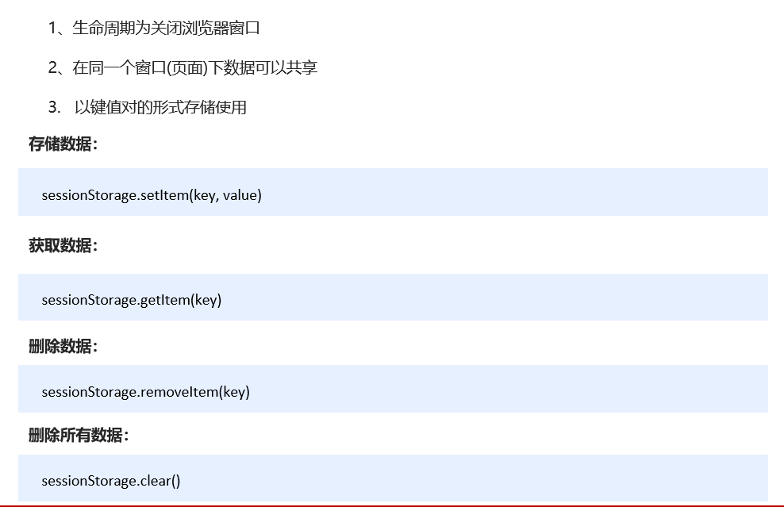
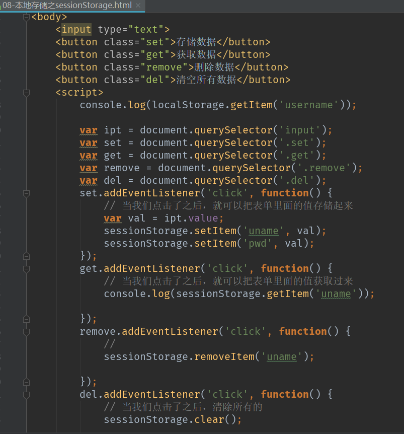
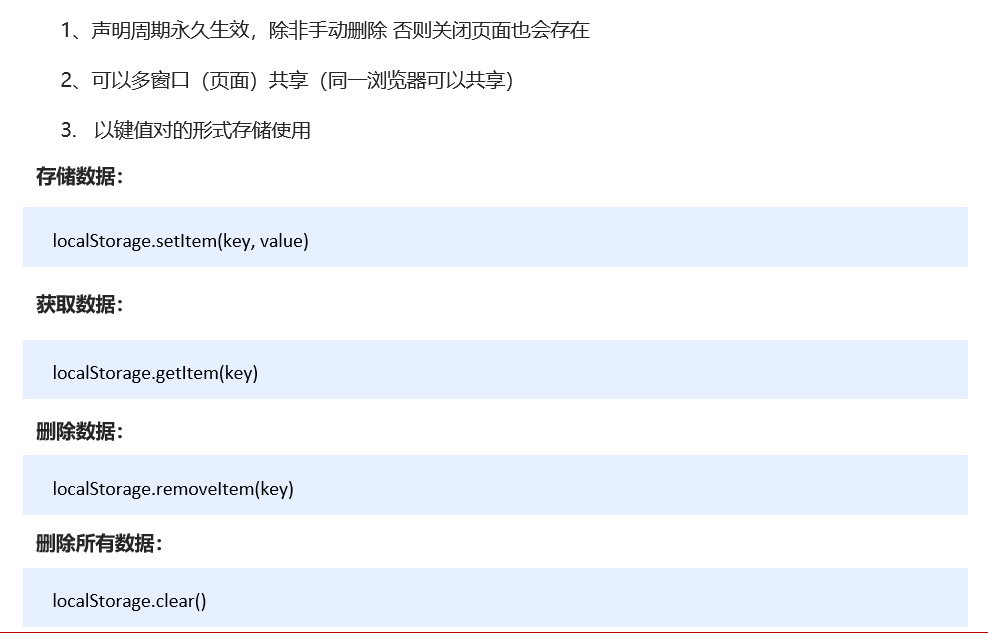

# **本地存储**

# **1.** **本地存储**



# **2**. **window.sessionStorage**



# **3**. **window.localStorage**



# 4. 记住用户名案列

```
<!DOCTYPE html>
<html lang="en">

<head>
    <meta charset="UTF-8">
    <meta name="viewport" content="width=device-width, initial-scale=1.0">
    <meta http-equiv="X-UA-Compatible" content="ie=edge">
    <title>Document</title>
</head>

<body>
    <input type="text" id="username"> <input type="checkbox" name="" id="remember"> 记住用户名
    <script>
        var username = document.querySelector('#username');
        var remember = document.querySelector('#remember');
        if (localStorage.getItem('username')) {
            username.value = localStorage.getItem('username');
            remember.checked = true;
        }
        remember.addEventListener('change', function() {
            if (this.checked) {
                localStorage.setItem('username', username.value)
            } else {
                localStorage.removeItem('username');
            }
        })
    </script>
</body>
```

