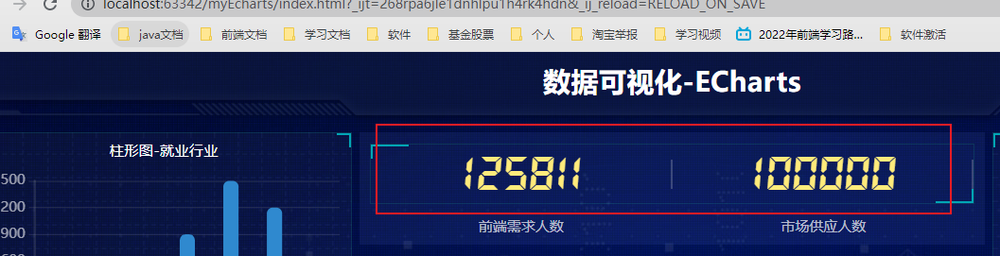

# echarts

# 1.ECharts的基本使用


# 2. 官方地址 和 下载地址 

## 2.1 ==官网地址==	

https://www.echartsjs.com/zh/index.html

## 2.2 ==下载地址==

 https://github.com/apache/echarts/tree/5.3.2/dist

## 2.3 ==使用文档==

​	https://echarts.apache.org/handbook/zh/get-started/


# 3.==Echarts-体验==


## 3.1 下载 echarts.min.js

https://github.com/apache/echarts/blame/5.3.2/dist/echarts.min.js

## 3.2 准备一个具备大小的DOM容器

```
<div id="main" style="width: 600px;height:400px;"></div>
```

## 3.3 初始化echarts实例对象

```js
var myChart = echarts.init(document.getElementById('main'));
```

## 3.4 指定配置项和数据(option)

```js
var option = {
    xAxis: {
        type: 'category',
        data: ['Mon', 'Tue', 'Wed', 'Thu', 'Fri', 'Sat', 'Sun']
    },
    yAxis: {
        type: 'value'
    },
    series: [{
        data: [820, 932, 901, 934, 1290, 1330, 1320],
        type: 'line'
    }]
};
```

## 3.5 将配置项设置给echarts实例对象

```js
myChart.setOption(option);
```

# 4 相关配置讲解


==示范案列==

```
option = {
    // color设置我们线条的颜色 注意后面是个数组
    color: ['pink', 'red', 'green', 'skyblue'],
    // 设置图表的标题
    title: {
        text: '折线图堆叠123'
    },
    // 图表的提示框组件 
    tooltip: {
        // 触发方式
        trigger: 'axis'
    },
    // 图例组件
    legend: {
       // series里面有了 name值则 legend里面的data可以删掉
    },
    // 网格配置  grid可以控制线形图 柱状图 图表大小
    grid: {
        left: '3%',
        right: '4%',
        bottom: '3%',
        // 是否显示刻度标签 如果是true 就显示 否则反之
        containLabel: true
    },
    // 工具箱组件  可以另存为图片等功能
    toolbox: {
        feature: {
            saveAsImage: {}
        }
    },
    // 设置x轴的相关配置
    xAxis: {
        type: 'category',
        // 是否让我们的线条和坐标轴有缝隙
        boundaryGap: false,
        data: ['星期一', '周二', '周三', '周四', '周五', '周六', '周日']
    },
     // 设置y轴的相关配置
    yAxis: {
        type: 'value'
    },
    // 系列图表配置 它决定着显示那种类型的图表
    series: [
        {
            name: '邮件营销',
            type: 'line',
           
            data: [120, 132, 101, 134, 90, 230, 210]
        },
        {
            name: '联盟广告',
            type: 'line',

            data: [220, 182, 191, 234, 290, 330, 310]
        },
        {
            name: '视频广告',
            type: 'line',
          
            data: [150, 232, 201, 154, 190, 330, 410]
        },
        {
            name: '直接访问',
            type: 'line',
          
            data: [320, 332, 301, 334, 390, 330, 320]
        }
    ]
};

```

## 4.1  title 标题组件  设置图表的标题

```
// 设置图表的标题
    title: {
        text: '折线图堆叠123'
    },
```

## 4.2  tooltip  图表的提示框组件


```
// 图表的提示框组件  结合图形和文档
    tooltip: {
        // 触发方式
        trigger: 'axis'
    },
```

## 4.3 legend 图例组件 (legend里面的data可以省略)

==series里面有了 name值则 legend里面的data可以省略不写,会自动填充==

```
// 图例组件
    legend: {
       // series里面有了 name值则 legend里面的data可以省略不写,会自动填充
    },
```

## 4.4  toolbox  工具箱组件   另存为图片等功能

```
// 工具箱组件  可以另存为图片等功能
    toolbox: {
        feature: {
            saveAsImage: {}
        }
    },
```

## 4.5  grid  网格配置 控制图表大小

```
// 网格配置  grid可以控制线形图 柱状图 图表大小
    grid: {
        left: '3%',
        right: '4%',
        bottom: '3%',
        // 是否显示刻度标签 如果是true 就显示 否则反之
        containLabel: true
    },
```

## 4.6  xAxis  设置x轴的相关配置

```
 // 设置x轴的相关配置
    xAxis: {
        type: 'category',
        // 是否让我们的线条和坐标轴有缝隙
        boundaryGap: false,
        data: ['星期一', '周二', '周三', '周四', '周五', '周六', '周日']
    },
```

## 4.7  yAxis  设置y轴的相关配置

```
 // 设置y轴的相关配置
    yAxis: {
        type: 'value'
    },
```

## 4.8 serier 系列列表  决定着显示图表的类型


```
// 系列图表配置 它决定着显示那种类型的图表
    series: [
        {
            name: '邮件营销',
            type: 'line',
           
            data: [120, 132, 101, 134, 90, 230, 210]
        },
        {
            name: '联盟广告',
            type: 'line',

            data: [220, 182, 191, 234, 290, 330, 310]
        },
        {
            name: '视频广告',
            type: 'line',
          
            data: [150, 232, 201, 154, 190, 330, 410]
        },
        {
            name: '直接访问',
            type: 'line',
          
            data: [320, 332, 301, 334, 390, 330, 320]
        }
    ]
```

## 4.9 color 调色盘颜色列表


```
// color设置我们线条的颜色 注意后面是个数组 可以超出数组长度
    color: ['pink', 'red', 'green', 'skyblue'],
```


# 5 rem 适配

## 5.1 webstorm 怎么把css转rem


```
/* 约束屏幕尺寸 */
@media screen and (max-width: 1024px) {
  html {
    font-size: 42px !important;
  }
}
@media screen and (min-width: 1920px) {
  html {
    font-size: 80px !important;
  }
}
```


# 6. 使用图标字体




# 7 柱状图1定制


- 官网找到类似实例， 适当分析，并且引入到HTML页面中
- 根据需求定制图表

## 7.1 引入js到html页面中

~~~javascript
// 柱状图1模块
(function() {
  // 实例化对象
  let myChart = echarts.init(document.querySelector(".bar .chart"));
  // 指定配置和数据
  let option = {
    color: ["#3398DB"],
    tooltip: {
      trigger: "axis",
      axisPointer: {
        // 坐标轴指示器，坐标轴触发有效
        type: "shadow" // 默认为直线，可选为：'line' | 'shadow'
      }
    },
    grid: {
      left: "3%",
      right: "4%",
      bottom: "3%",
      containLabel: true
    },
    xAxis: [
      {
        type: "category",
        data: ["Mon", "Tue", "Wed", "Thu", "Fri", "Sat", "Sun"],
        axisTick: {
          alignWithLabel: true
        }
      }
    ],
    yAxis: [
      {
        type: "value"
      }
    ],
    series: [
      {
        name: "直接访问",
        type: "bar",
        barWidth: "60%",
        data: [10, 52, 200, 334, 390, 330, 220]
      }
    ]
  };

  // 把配置给实例对象
  myChart.setOption(option);
})();
~~~

## 7.2 根据需求定制样式,填充数据

- 修改图表柱形颜色  #2f89cf


   - 修改图表大小  top 为 10px   bottom 为  4%    grid决定我们的柱状图的大小

   ~~~JavaScript
   color: ["#2f89cf"],
   grid: {
     left: "0%",
     top: "10px",
     right: "0%",
     bottom: "4%",
     containLabel: true
   },
   ~~~

   - X轴相关设置  xAxis
     - 文本颜色设置为   rgba(255,255,255,.6)   字体大小为 12px
     - X轴线的样式 不显示

   ~~~JavaScript
   // 设置x轴标签文字样式
  // x轴的文字颜色和大小
        axisLabel: {
          color: "rgba(255,255,255,.6)",
          fontSize: "12"
        },
   //  x轴样式不显示
   axisLine: {
       show: false
       // 如果想要设置单独的线条样式 
       // lineStyle: {
       //    color: "rgba(255,255,255,.1)",
       //    width: 1,
       //    type: "solid"
      }
   }
   ~~~

   - Y 轴相关定制
     - 文本颜色设置为   rgba(255,255,255,.6)   字体大小为 12px
     - Y 轴线条样式 更改为  1像素的  rgba(255,255,255,.1) 边框
     - 分隔线的颜色修饰为  1像素的  rgba(255,255,255,.1)   

   ~~~JavaScript
   // y 轴文字标签样式
   axisLabel: {
         color: "rgba(255,255,255,.6)",
          fontSize: "12"
   },
    // y轴线条样式
    axisLine: {
         lineStyle: {
            color: "rgba(255,255,255,.1)",
            // width: 1,
            // type: "solid"
         }
   5232},
    // y 轴分隔线样式
   splitLine: {
       lineStyle: {
          color: "rgba(255,255,255,.1)"
        }
   }
   ~~~

   - 修改柱形为圆角以及柱子宽度  series 里面设置

   ~~~JavaScript
   series: [
         {
           name: "直接访问",
           type: "bar",
           // 修改柱子宽度
           barWidth: "35%",
           data: [10, 52, 200, 334, 390, 330, 220],
           itemStyle: {
             // 修改柱子圆角
             barBorderRadius: 5
           }
         }
       ]
     };
   ~~~

   - 更换对应数据

   ~~~JavaScript
   // x轴中更换data数据
    data: [ "旅游行业","教育培训", "游戏行业", "医疗行业", "电商行业", "社交行业", "金融行业" ],
   // series 更换数据
    data: [200, 300, 300, 900, 1500, 1200, 600]
   ~~~

- 让图表跟随屏幕自适应

~~~javascript
  window.addEventListener("resize", function() {
    myChart.resize();
  });
~~~

## 7.3 完整代码

```javascript
// 柱状图模块1
(function() {
  // 1实例化对象
  var myChart = echarts.init(document.querySelector(".bar .chart"));
  // 2. 指定配置项和数据
  var option = {
    color: ["#2f89cf"],
    tooltip: {
      trigger: "axis",
      axisPointer: {
        // 坐标轴指示器，坐标轴触发有效
        type: "shadow" // 默认为直线，可选为：'line' | 'shadow'
      }
    },
    // 修改图表的大小
    grid: {
      left: "0%",
      top: "10px",
      right: "0%",
      bottom: "4%",
      containLabel: true
    },
    xAxis: [
      {
        type: "category",
        data: [
          "旅游行业",
          "教育培训",
          "游戏行业",
          "医疗行业",
          "电商行业",
          "社交行业",
          "金融行业"
        ],
        axisTick: {
          alignWithLabel: true
        },
        // 修改刻度标签 相关样式
        axisLabel: {
          color: "rgba(255,255,255,.6) ",
          fontSize: "12"
        },
        // 不显示x坐标轴的样式
        axisLine: {
          show: false
        }
      }
    ],
    yAxis: [
      {
        type: "value",
        // 修改刻度标签 相关样式
        axisLabel: {
          color: "rgba(255,255,255,.6) ",
          fontSize: 12
        },
        // y轴的线条改为了 2像素
        axisLine: {
          lineStyle: {
            color: "rgba(255,255,255,.1)",
            width: 2
          }
        },
        // y轴分割线的颜色
        splitLine: {
          lineStyle: {
            color: "rgba(255,255,255,.1)"
          }
        }
      }
    ],
    series: [
      {
        name: "直接访问",
        type: "bar",
        barWidth: "35%",
        data: [200, 300, 300, 900, 1500, 1200, 600],
        itemStyle: {
          // 修改柱子圆角
          barBorderRadius: 5
        }
      }
    ]
  };
  // 3. 把配置项给实例对象
  myChart.setOption(option);
  // 4. 让图表跟随屏幕自动的去适应
  window.addEventListener("resize", function() {
    myChart.resize();
  });
})();
```

# 8 柱状图2定制


- 官网找到类似实例， 适当分析，并且引入到HTML页面中 
- 根据需求定制图表

## 8.1 根据需求定制样式,填充数据

需求1： 修改图形大小 grid

~~~javascript
  // 图标位置
    grid: {
      top: "10%",
      left: "22%",
      bottom: "10%"
    },
~~~

需求2： 不显示x轴 

~~~javascript
   xAxis: {
      show: false
    },
~~~

需求3： y轴相关定制

- 不显示y轴线和相关刻度

~~~javascript
//不显示y轴线条
axisLine: {
    show: false
        },
// 不显示刻度
axisTick: {
   show: false
},
~~~

- y轴文字的颜色设置为白色

~~~javascript
   axisLabel: {
          color: "#fff"
   },
~~~

需求4： 修改第一组柱子相关样式（条状）

~~~javascript
name: "条",
// 柱子之间的距离
barCategoryGap: 50,
//柱子的宽度
barWidth: 10,
// 柱子设为圆角
itemStyle: {
    normal: {
      barBorderRadius: 20,       
    }
},
~~~

- 设置第一组柱子内百分比显示数据

~~~javascript
// 图形上的文本标签
label: {
    normal: {
         show: true,
         // 图形内显示
         position: "inside",
         // 文字的显示格式
         formatter: "{c}%"
     }
},
~~~

- 设置第一组柱子不同颜色

~~~javascript
// 声明颜色数组
var myColor = ["#1089E7", "#F57474", "#56D0E3", "#F8B448", "#8B78F6"];
// 2. 给 itemStyle  里面的color 属性设置一个 返回值函数
  itemStyle: {
          normal: {
            barBorderRadius: 20,  
            // params 传进来的是柱子对象
            console.log(params);
            // dataIndex 是当前柱子的索引号
            return myColor[params.dataIndex];
          }
         
},
~~~

需求5： 修改第二组柱子的相关配置（框状）

~~~javascript
  	    name: "框",
        type: "bar",
        barCategoryGap: 50,
        barWidth: 15,
        itemStyle: {
            color: "none",
            borderColor: "#00c1de",
            borderWidth: 3,
            barBorderRadius: 15
        },
        data: [19325, 23438, 31000, 121594, 134141, 681807]
      }
~~~

需求6： 给y轴添加第二组数据

~~~javascript
yAxis: [
      {
      type: "category",
      data: ["印尼", "美国", "印度", "中国", "世界人口(万)"],
      // 不显示y轴的线
      axisLine: {
        show: false
      },
      // 不显示刻度
      axisTick: {
        show: false
      },
      // 把刻度标签里面的文字颜色设置为白色
      axisLabel: {
        color: "#fff"
      }
    },
      {
        show: true,
        data: [702, 350, 610, 793, 664],
           // 不显示y轴的线
      axisLine: {
        show: false
      },
      // 不显示刻度
      axisTick: {
        show: false
      },
        axisLabel: {
          textStyle: {
            fontSize: 12,
            color: "#fff"
          }
        }
      }
    ],
~~~

需求7： 设置两组柱子层叠以及更换数据

~~~javascript
// 给series  第一个对象里面的 添加 
yAxisIndex: 0,
// 给series  第二个对象里面的 添加 
yAxisIndex: 1,
// series 第一个对象里面的data
data: [70, 34, 60, 78, 69],
// series 第二个对象里面的data
data: [100, 100, 100, 100, 100],
// y轴更换第一个对象更换data数据
data: ["HTML5", "CSS3", "javascript", "VUE", "NODE"],
// y轴更换第二个对象更换data数据
data:[702, 350, 610, 793, 664],
~~~

## 8.2 完整代码：

~~~javascript
// 柱状图2
(function() {
  var myColor = ["#1089E7", "#F57474", "#56D0E3", "#F8B448", "#8B78F6"];
  // 1. 实例化对象
  var myChart = echarts.init(document.querySelector(".bar2 .chart"));
  // 2. 指定配置和数据
  var option = {
    grid: {
      top: "10%",
      left: "22%",
      bottom: "10%"
      // containLabel: true
    },
    // 不显示x轴的相关信息
    xAxis: {
      show: false
    },
    yAxis: [
      {
        type: "category",
        inverse: true,
        data: ["HTML5", "CSS3", "javascript", "VUE", "NODE"],
        // 不显示y轴的线
        axisLine: {
          show: false
        },
        // 不显示刻度
        axisTick: {
          show: false
        },
        // 把刻度标签里面的文字颜色设置为白色
        axisLabel: {
          color: "#fff"
        }
      },
      {
        data: [702, 350, 610, 793, 664],
        inverse: true,
        // 不显示y轴的线
        axisLine: {
          show: false
        },
        // 不显示刻度
        axisTick: {
          show: false
        },
        // 把刻度标签里面的文字颜色设置为白色
        axisLabel: {
          color: "#fff"
        }
      }
    ],
    series: [
      {
        name: "条",
        type: "bar",
        data: [70, 34, 60, 78, 69],
        yAxisIndex: 0,
        // 修改第一组柱子的圆角
        itemStyle: {
          barBorderRadius: 20,
          // 此时的color 可以修改柱子的颜色
          color: function(params) {
            // params 传进来的是柱子对象
            console.log(params);
            // dataIndex 是当前柱子的索引号
            return myColor[params.dataIndex];
          }
        },
        // 柱子之间的距离
        barCategoryGap: 50,
        //柱子的宽度
        barWidth: 10,
        // 显示柱子内的文字
        label: {
          show: true,
          position: "inside",
          // {c} 会自动的解析为 数据  data里面的数据
          formatter: "{c}%"
        }
      },
      {
        name: "框",
        type: "bar",
        barCategoryGap: 50,
        barWidth: 15,
        yAxisIndex: 1,
        data: [100, 100, 100, 100, 100],
        itemStyle: {
          color: "none",
          borderColor: "#00c1de",
          borderWidth: 3,
          barBorderRadius: 15
        }
      }
    ]
  };

  // 3. 把配置给实例对象
  myChart.setOption(option);
})();

~~~

# 9 折线图1-人员变化模块制作


- 官网找到类似实例， 适当分析，并且引入到HTML页面中 
- 根据需求定制图表

## 9.1 根据需求定制样式,填充数据

需求1： 修改折线图大小，显示边框设置颜色：#012f4a，并且显示刻度标签。

```js
    // 设置网格样式
    grid: { 
      top: '20%',
      left: '3%',
      right: '4%',
      bottom: '3%',
      show: true,// 显示边框
      borderColor: '#012f4a',// 边框颜色
      containLabel: true // 包含刻度文字在内
    },
```

需求2： 修改图例组件中的文字颜色 #4c9bfd， 距离右侧 right 为 10%

```javascript
 // 图例组件
    legend: {
      textStyle: {
        color: '#4c9bfd' // 图例文字颜色
      },
      right: '10%' // 距离右边10%
    },
```

需求3： x轴相关配置

- 刻度去除
- x轴刻度标签字体颜色：#4c9bfd
- 剔除x坐标轴线颜色（将来使用Y轴分割线)
- 轴两端是不需要内间距 boundaryGap

```javascript
    xAxis: {
      type: 'category',
      data: ["周一", "周二"],
	  axisTick: {
         show: false // 去除刻度线
       },
       axisLabel: {
         color: '#4c9bfd' // 文本颜色
       },
       axisLine: {
         show: false // 去除轴线
       },
       boundaryGap: false  // 去除轴内间距
    },
```

需求4： y轴的定制

- 刻度去除
- 字体颜色：#4c9bfd
- 分割线颜色：#012f4a

```javascript
    yAxis: {
      type: 'value',
      axisTick: {
        show: false  // 去除刻度
      },
      axisLabel: {
        color: '#4c9bfd' // 文字颜色
      },
      splitLine: {
        lineStyle: {
          color: '#012f4a' // 分割线颜色
        }
      }
    },
```

需求5： 两条线形图定制

- 颜色分别：#00f2f1  #ed3f35
- 把折线修饰为圆滑 series 数据中添加 smooth 为 true

```js
    color: ['#00f2f1', '#ed3f35'],
	series: [{
      name:'新增粉丝',
      data: [820, 932, 901, 934, 1290, 1330, 1320],
      type: 'line',
      // 折线修饰为圆滑
      smooth: true,
      },{
      name:'新增游客',
      data: [100, 331, 200, 123, 233, 543, 400],
      type: 'line',
      smooth: true,
    }]
```

需求6： 配置数据

```js
// x轴的文字
xAxis: {
  type: 'category',
  data: ['1月', '2月', '3月', '4月', '5月', '6月', '7月', '8月', '9月', '10月', '11月', '12月'],
```

```js
// 图标数据
    series: [{
      name:'新增粉丝',
      data:  [24, 40, 101, 134, 90, 230, 210, 230, 120, 230, 210, 120],
      type: 'line',
      smooth: true
    },{
      name:'新增游客',
      data: [40, 64, 191, 324, 290, 330, 310, 213, 180, 200, 180, 79],     
      type: 'line',
      smooth: true
      }
    }]
```

需求7： 新增需求  点击 2020年   2021年 数据发生变化

以下是后台送过来数据（ajax请求过来的）

~~~javascript
 var yearData = [
      {
        year: '2020',  // 年份
        data: [  // 两个数组是因为有两条线
             [24, 40, 101, 134, 90, 230, 210, 230, 120, 230, 210, 120],
             [40, 64, 191, 324, 290, 330, 310, 213, 180, 200, 180, 79]
          ]
      },
      {
        year: '2021',  // 年份
        data: [  // 两个数组是因为有两条线
             [123, 175, 112, 197, 121, 67, 98, 21, 43, 64, 76, 38],
     		[143, 131, 165, 123, 178, 21, 82, 64, 43, 60, 19, 34]
          ]
      }
     ];
~~~

- tab栏切换事件
- 点击2020按钮   需要把 series 第一个对象里面的data  换成  2020年对象里面data[0] 
- 点击2020按钮   需要把 series 第二个对象里面的data  换成  2020年对象里面data[1] 
- 2021 按钮同样道理

## 9.2 完整代码：

~~~javascript
// 折线图1模块制作
(function() {
  var yearData = [
    {
      year: "2020", // 年份
      data: [
        // 两个数组是因为有两条线
        [24, 40, 101, 134, 90, 230, 210, 230, 120, 230, 210, 120],
        [40, 64, 191, 324, 290, 330, 310, 213, 180, 200, 180, 79]
      ]
    },
    {
      year: "2021", // 年份
      data: [
        // 两个数组是因为有两条线
        [123, 175, 112, 197, 121, 67, 98, 21, 43, 64, 76, 38],
        [143, 131, 165, 123, 178, 21, 82, 64, 43, 60, 19, 34]
      ]
    }
  ];
  // 1. 实例化对象
  var myChart = echarts.init(document.querySelector(".line .chart"));
  // 2.指定配置
  var option = {
    // 通过这个color修改两条线的颜色
    color: ["#00f2f1", "#ed3f35"],
    tooltip: {
      trigger: "axis"
    },
    legend: {
      // 如果series 对象有name 值，则 legend可以不用写data
      // 修改图例组件 文字颜色
      textStyle: {
        color: "#4c9bfd"
      },
      // 这个10% 必须加引号
      right: "10%"
    },
    grid: {
      top: "20%",
      left: "3%",
      right: "4%",
      bottom: "3%",
      show: true, // 显示边框
      borderColor: "#012f4a", // 边框颜色
      containLabel: true // 包含刻度文字在内
    },

    xAxis: {
      type: "category",
      boundaryGap: false,
      data: [
        "1月",
        "2月",
        "3月",
        "4月",
        "5月",
        "6月",
        "7月",
        "8月",
        "9月",
        "10月",
        "11月",
        "12月"
      ],
      axisTick: {
        show: false // 去除刻度线
      },
      axisLabel: {
        color: "#4c9bfd" // 文本颜色
      },
      axisLine: {
        show: false // 去除轴线
      }
    },
    yAxis: {
      type: "value",
      axisTick: {
        show: false // 去除刻度线
      },
      axisLabel: {
        color: "#4c9bfd" // 文本颜色
      },
      axisLine: {
        show: false // 去除轴线
      },
      splitLine: {
        lineStyle: {
          color: "#012f4a" // 分割线颜色
        }
      }
    },
    series: [
      {
        name: "新增粉丝",
        type: "line",
        // true 可以让我们的折线显示带有弧度
        smooth: true,
        data: yearData[0].data[0]
      },
      {
        name: "新增游客",
        type: "line",
        smooth: true,
        data: yearData[0].data[1]
      }
    ]
  };

  // 3. 把配置给实例对象
  myChart.setOption(option);
  // 4. 让图表跟随屏幕自动的去适应
  window.addEventListener("resize", function() {
    myChart.resize();
  });

  // 5.点击切换效果
  $(".line h2").on("click", "a", function() {
    // alert(1);
    // console.log($(this).index());
    // 点击 a 之后 根据当前a的索引号 找到对应的 yearData的相关对象
    // console.log(yearData[$(this).index()]);
    var obj = yearData[$(this).index()];
    option.series[0].data = obj.data[0];
    option.series[1].data = obj.data[1];
    // 需要重新渲染
    myChart.setOption(option);
  });
})();
~~~

# 10 折线图2 播放量模块制作


- 官网找到类似实例， 适当分析，并且引入到HTML页面中 
- 根据需求定制图表

## 10.1 根据需求定制样式,填充数据

需求1： 更换图例组件文字颜色 rgba(255,255,255,.5)  文字大小为12

~~~javascript
 legend: {
      top: "0%",
      textStyle: {
        color: "rgba(255,255,255,.5)",
        fontSize: "12"
      }
},
~~~

需求2： 修改图表大小

~~~javascript
grid: {
      left: "10",
      top: "30",
      right: "10",
      bottom: "10",
      containLabel: true
    },
~~~

需求3： 修改x轴相关配置

- 修改文本颜色为rgba(255,255,255,.6)  文字大小为 12
- x轴线的颜色为   rgba(255,255,255,.2)

~~~javascript
     // 文本颜色为rgba(255,255,255,.6)  文字大小为 12
     axisLabel: {
          textStyle: {
            color: "rgba(255,255,255,.6)",
            fontSize: 12
          }
        },
         // x轴线的颜色为   rgba(255,255,255,.2)
        axisLine: {
          lineStyle: {
            color: "rgba(255,255,255,.2)"
          }
        },
~~~

需求4： 修改y轴的相关配置

~~~javascript
        axisTick: { show: false },
        axisLine: {
          lineStyle: {
            color: "rgba(255,255,255,.1)"
          }
        },
        axisLabel: {
          textStyle: {
            color: "rgba(255,255,255,.6)",
            fontSize: 12
          }
        },
	   // 修改分割线的颜色
        splitLine: {
          lineStyle: {
            color: "rgba(255,255,255,.1)"
          }
        }
      
~~~

需求5： 修改两个线模块配置(注意在series 里面定制)

~~~javascript
       //第一条 线是圆滑
       smooth: true,
        // 单独修改线的样式
        lineStyle: {
            color: "#0184d5",
            width: 2 
        },
         // 填充区域
        areaStyle: {
              // 渐变色，只需要复制即可
            color: new echarts.graphic.LinearGradient(
              0,
              0,
              0,
              1,
              [
                {
                  offset: 0,
                  color: "rgba(1, 132, 213, 0.4)"   // 渐变色的起始颜色
                },
                {
                  offset: 0.8,
                  color: "rgba(1, 132, 213, 0.1)"   // 渐变线的结束颜色
                }
              ],
              false
            ),
            shadowColor: "rgba(0, 0, 0, 0.1)"
        },
        // 设置拐点 小圆点
        symbol: "circle",
        // 拐点大小
        symbolSize: 8,
        // 设置拐点颜色以及边框
       itemStyle: {
            color: "#0184d5",
            borderColor: "rgba(221, 220, 107, .1)",
            borderWidth: 12
        },
        // 开始不显示拐点， 鼠标经过显示
        showSymbol: false,
~~~

~~~javascript
       name: "转发量",
        type: "line",
        smooth: true,
        lineStyle: {
          normal: {
            color: "#00d887",
            width: 2
          }
         },
         areaStyle: {
          normal: {
            color: new echarts.graphic.LinearGradient(
              0,
              0,
              0,
              1,
              [
                {
                  offset: 0,
                  color: "rgba(0, 216, 135, 0.4)"
                },
                {
                  offset: 0.8,
                  color: "rgba(0, 216, 135, 0.1)"
                }
              ],
              false
            ),
            shadowColor: "rgba(0, 0, 0, 0.1)"
          }
        },
        // 设置拐点 小圆点
        symbol: "circle",
        // 拐点大小
        symbolSize: 5,
        // 设置拐点颜色以及边框
         itemStyle: {
            color: "#00d887",
            borderColor: "rgba(221, 220, 107, .1)",
            borderWidth: 12
        },
        // 开始不显示拐点， 鼠标经过显示
        showSymbol: false,
~~~


需求6： 更换数据

~~~javascript
// x轴更换数据
data: [ "01","02","03","04","05","06","07","08","09","10","11","12","13","14","15","16","17","18","19","20","21","22","23","24","25","26","26","28","29","30"],
// series  第一个对象data数据
 data: [ 30, 40, 30, 40,30, 40, 30,60,20, 40, 30, 40, 30, 40,30, 40, 30,60,20, 40, 30, 40, 30, 40,30, 40, 20,60,50, 40],
// series  第二个对象data数据
 data: [ 130, 10, 20, 40,30, 40, 80,60,20, 40, 90, 40,20, 140,30, 40, 130,20,20, 40, 80, 70, 30, 40,30, 120, 20,99,50, 20],

~~~

## 10.2 完整代码

```javascript
// 折线图2 模块制作
(function() {
  var myChart = echarts.init(document.querySelector(".line2 .chart"));
  var option = {
    tooltip: {
      trigger: "axis"
    },
    legend: {
      top: "0%",
      data: ["邮件营销", "联盟广告", "视频广告", "直接访问", "搜索引擎"],
      textStyle: {
        color: "rgba(255,255,255,.5)",
        fontSize: "12"
      }
    },

    grid: {
      left: "10",
      top: "30",
      right: "10",
      bottom: "10",
      containLabel: true
    },
    xAxis: [
      {
        type: "category",
        boundaryGap: false,
        // x轴更换数据
        data: [
          "01",
          "02",
          "03",
          "04",
          "05",
          "06",
          "07",
          "08",
          "09",
          "10",
          "11",
          "12",
          "13",
          "14",
          "15",
          "16",
          "17",
          "18",
          "19",
          "20",
          "21",
          "22",
          "23",
          "24",
          "25",
          "26",
          "26",
          "28",
          "29",
          "30"
        ],
        // 文本颜色为rgba(255,255,255,.6)  文字大小为 12
        axisLabel: {
          textStyle: {
            color: "rgba(255,255,255,.6)",
            fontSize: 12
          }
        },
        // x轴线的颜色为   rgba(255,255,255,.2)
        axisLine: {
          lineStyle: {
            color: "rgba(255,255,255,.2)"
          }
        }
      }
    ],
    yAxis: [
      {
        type: "value",
        axisTick: { show: false },
        axisLine: {
          lineStyle: {
            color: "rgba(255,255,255,.1)"
          }
        },
        axisLabel: {
          textStyle: {
            color: "rgba(255,255,255,.6)",
            fontSize: 12
          }
        },
        // 修改分割线的颜色
        splitLine: {
          lineStyle: {
            color: "rgba(255,255,255,.1)"
          }
        }
      }
    ],
    series: [
      {
        name: "邮件营销",
        type: "line",
        smooth: true,
        // 单独修改当前线条的样式
        lineStyle: {
          color: "#0184d5",
          width: "2"
        },
        // 填充颜色设置
        areaStyle: {
          color: new echarts.graphic.LinearGradient(
            0,
            0,
            0,
            1,
            [
              {
                offset: 0,
                color: "rgba(1, 132, 213, 0.4)" // 渐变色的起始颜色
              },
              {
                offset: 0.8,
                color: "rgba(1, 132, 213, 0.1)" // 渐变线的结束颜色
              }
            ],
            false
          ),
          shadowColor: "rgba(0, 0, 0, 0.1)"
        },
        // 设置拐点
        symbol: "circle",
        // 拐点大小
        symbolSize: 8,
        // 开始不显示拐点， 鼠标经过显示
        showSymbol: false,
        // 设置拐点颜色以及边框
        itemStyle: {
          color: "#0184d5",
          borderColor: "rgba(221, 220, 107, .1)",
          borderWidth: 12
        },
        data: [
          30,
          40,
          30,
          40,
          30,
          40,
          30,
          60,
          20,
          40,
          30,
          40,
          30,
          40,
          30,
          40,
          30,
          60,
          20,
          40,
          30,
          40,
          30,
          40,
          30,
          40,
          20,
          60,
          50,
          40
        ]
      },
      {
        name: "联盟广告",
        type: "line",
        smooth: true,
        lineStyle: {
          normal: {
            color: "#00d887",
            width: 2
          }
        },
        areaStyle: {
          normal: {
            color: new echarts.graphic.LinearGradient(
              0,
              0,
              0,
              1,
              [
                {
                  offset: 0,
                  color: "rgba(0, 216, 135, 0.4)"
                },
                {
                  offset: 0.8,
                  color: "rgba(0, 216, 135, 0.1)"
                }
              ],
              false
            ),
            shadowColor: "rgba(0, 0, 0, 0.1)"
          }
        },
        // 设置拐点 小圆点
        symbol: "circle",
        // 拐点大小
        symbolSize: 5,
        // 设置拐点颜色以及边框
        itemStyle: {
          color: "#00d887",
          borderColor: "rgba(221, 220, 107, .1)",
          borderWidth: 12
        },
        // 开始不显示拐点， 鼠标经过显示
        showSymbol: false,
        data: [
          130,
          10,
          20,
          40,
          30,
          40,
          80,
          60,
          20,
          40,
          90,
          40,
          20,
          140,
          30,
          40,
          130,
          20,
          20,
          40,
          80,
          70,
          30,
          40,
          30,
          120,
          20,
          99,
          50,
          20
        ]
      }
    ]
  };
  myChart.setOption(option);
  // 4. 让图表跟随屏幕自动的去适应
  window.addEventListener("resize", function() {
    myChart.resize();
  });
})();
```


#  11. 饼形图1-年龄分布模块制作


- 官网找到类似实例， 适当分析，并且引入到HTML页面中 
- 根据需求定制图表

## 11.1  根据需求定制样式,填充数据

定制图表需求1： 

- 修改图例组件在底部并且居中显示。 
- 每个小图标的宽度和高度修改为 10px   
- 文字大小为12 颜色  rgba(255,255,255,.5)

~~~javascript
 legend: {
      // 距离底部为0%
      bottom: "0%",
      // 小图标的宽度和高度
      itemWidth: 10,
      itemHeight: 10,
      data: ['直接访问', '邮件营销', '联盟广告', '视频广告', '搜索引擎'],
      // 修改图例组件的文字为 12px
      textStyle: {
        color: "rgba(255,255,255,.5)",
        fontSize: "12"
      }
 },
~~~

定制需求2：

- 修改水平居中 垂直居中
- 修改内圆半径和外圆半径为    ["40%", "60%"]   pink老师友情提示，带有直角坐标系的比如折线图柱状图是 grid修改图形大小，而我们饼形图是通过 radius 修改大小

~~~javascript
series: [
      {
        name: "年龄分布",
        type: "pie",
        // 设置饼形图在容器中的位置
        center: ["50%", "50%"],
        //  修改内圆半径和外圆半径为  百分比是相对于容器宽度来说的
        radius: ["40%", "60%"],
        // 不显示标签文字
        label: { show: false },
        // 不显示连接线
        labelLine: { show: false },
      }
    ]
~~~

定制需求3：更换数据

~~~javascript
// legend 中的data  可省略   只要 series 中的数据的 name 存在  就可以省略
data: ["0岁以下", "20-29岁", "30-39岁", "40-49岁", "50岁以上"],
//  series 中的数据
 data: [
          { value: 1, name: "0岁以下" },
          { value: 4, name: "20-29岁" },
          { value: 2, name: "30-39岁" },
          { value: 2, name: "40-49岁" },
          { value: 1, name: "50岁以上" }
 ] ,
~~~

定制需求4： 更换颜色

~~~javascript
color: [
          "#065aab",
          "#066eab",
          "#0682ab",
          "#0696ab",
          "#06a0ab",
        ],
~~~

~~~javascript
 // 4. 让图表跟随屏幕自动的去适应
  window.addEventListener("resize", function() {
    myChart.resize();
  });
~~~

## 11.2 完整代码

```javascript
// 饼形图1
(function() {
  // 1. 实例化对象
  var myChart = echarts.init(document.querySelector(".pie .chart"));
  // 2.指定配置
  var option = {
    color: ["#065aab", "#066eab", "#0682ab", "#0696ab", "#06a0ab"],
    tooltip: {
      trigger: "item",
      formatter: "{a} <br/>{b}: {c} ({d}%)"
    },

    legend: {
      bottom: "0%",
      // 修改小图标的大小
      itemWidth: 10,
      itemHeight: 10,
      // 修改图例组件的文字为 12px
      textStyle: {
        color: "rgba(255,255,255,.5)",
        fontSize: "12"
      }
    },
    series: [
      {
        name: "年龄分布",
        type: "pie",
        // 这个radius可以修改饼形图的大小
        // radius 第一个值是内圆的半径 第二个值是外圆的半径
        radius: ["40%", "60%"],
        center: ["50%", "45%"],
        avoidLabelOverlap: false,
        // 图形上的文字
        label: {
          show: false,
          position: "center"
        },
        // 链接文字和图形的线是否显示
        labelLine: {
          show: false
        },
        data: [
          { value: 1, name: "0岁以下" },
          { value: 4, name: "20-29岁" },
          { value: 2, name: "30-39岁" },
          { value: 2, name: "40-49岁" },
          { value: 1, name: "50岁以上" }
        ]
      }
    ]
  };

  // 3. 把配置给实例对象
  myChart.setOption(option);
  // 4. 让图表跟随屏幕自动的去适应
  window.addEventListener("resize", function() {
    myChart.resize();
  });
})();
```

# 12 饼形图2 地区分布模块制作（南丁格尔玫瑰图）


- 官网找到类似实例， 适当分析，并且引入到HTML页面中 
- 根据需求定制图表

## 12.1 根据需求定制样式,填充数据

第二步：按照需求定制

- 需求1：颜色设置

```js
color: ['#006cff', '#60cda0', '#ed8884', '#ff9f7f', '#0096ff', '#9fe6b8', '#32c5e9', '#1d9dff'],
```

- 需求2：修改饼形图大小 ( series对象)

```javascript
radius: ['10%', '70%'],
```

- 需求3： 把饼形图的显示模式改为 半径模式

```javascript
 roseType: "radius",
```

- 需求4：数据使用更换（series对象 里面 data对象）

```js
          { value: 20, name: '云南' },
          { value: 26, name: '北京' },
          { value: 24, name: '山东' },
          { value: 25, name: '河北' },
          { value: 20, name: '江苏' },
          { value: 25, name: '浙江' },
          { value: 30, name: '四川' },
          { value: 42, name: '湖北' }
```

- 需求5：字体略小些  10 px ( series对象里面设置 )

  饼图图形上的文本标签可以控制饼形图的文字的一些样式。   label 对象设置

```javascript
series: [
      {
        name: "面积模式",
        type: "pie",
        radius: [30, 110],
        center: ["50%", "50%"],
        roseType: "radius",
        // 文本标签控制饼形图文字的相关样式， 注意它是一个对象
        label: {
          fontSize: 10
        },
      }
    ]
  };
```

- 需求6：防止缩放的时候，引导线过长。引导线略短些   (series对象里面的  labelLine  对象设置  ) 
  - 连接图表 6 px
  - 连接文字 8 px

```javascript
		// 链接图形和文字的线条
        labelLine: {
          // length 链接图形的线条
          length: 6,
          // length2 链接文字的线条
          length2: 8
        },
```


```
legend: {
      bottom: "0%",
      itemWidth: 10,
      itemHeight: 10,
      textStyle: {
        color: "rgba(255,255,255,.5)",
        fontSize: "12"
      }
    },
```

- 需求8：浏览器缩放的时候，图表跟着自动适配。

```javascript
// 监听浏览器缩放，图表对象调用缩放resize函数
window.addEventListener("resize", function() {
    myChart.resize();
  });
```

## 12.2 完整代码

```javascript
// 饼形图2 地区分布模块
(function() {
  var myChart = echarts.init(document.querySelector(".pie2 .chart"));
  var option = {
    color: [
      "#006cff",
      "#60cda0",
      "#ed8884",
      "#ff9f7f",
      "#0096ff",
      "#9fe6b8",
      "#32c5e9",
      "#1d9dff"
    ],
    tooltip: {
      trigger: "item",
      formatter: "{a} <br/>{b} : {c} ({d}%)"
    },
    legend: {
      bottom: "0%",
      itemWidth: 10,
      itemHeight: 10,
      textStyle: {
        color: "rgba(255,255,255,.5)",
        fontSize: "12"
      }
    },
    series: [
      {
        name: "地区分布",
        type: "pie",
        radius: ["10%", "70%"],
        center: ["50%", "50%"],
        roseType: "radius",
        // 图形的文字标签
        label: {
          fontSize: 10
        },
        // 链接图形和文字的线条
        labelLine: {
          // length 链接图形的线条
          length: 6,
          // length2 链接文字的线条
          length2: 8
        },
        data: [
          { value: 20, name: "云南" },
          { value: 26, name: "北京" },
          { value: 24, name: "山东" },
          { value: 25, name: "河北" },
          { value: 20, name: "江苏" },
          { value: 25, name: "浙江" },
          { value: 30, name: "四川" },
          { value: 42, name: "湖北" }
        ]
      }
    ]
  };
  myChart.setOption(option);
  // 监听浏览器缩放，图表对象调用缩放resize函数
  window.addEventListener("resize", function() {
    myChart.resize();
  });
})();
```

# 13 Echarts-社区介绍

## 13.1 社区网址 (旧版无法访问,使用备用地址)

==Echarts社区已停止运营，下面存在开源网站==

==第一个：www.isqqw.com/#/homepage，多个分类， 可在线调试和切换版本。==

==第二个：http://www.ppchart.com 多个分类，可在线调试。==

==第三个，跟之前开源社区网址很像，但是不确定是否是同一个，功能很全：==https://www.makeapie.cn/echarts


- 在这里可以找到一些基于echart的高度定制好的图表，相当于基于jquery开发的插件，这里是基于echarts开发的第三方的图表。

# 14 Echarts-map使用（扩展）

参考社区的例子：https://gallery.echartsjs.com/editor.html?c=x0-ExSkZDM  (模拟飞机航线)

## 14.1 实现步骤：

- ==第一需要下载china.js提供中国地图的js文件==
- 第二个因为里面代码比较多，我们新建一个新的js文件 myMap.js 引入
- 使用社区提供的配置即可。

## 14.2 需要修改：

- 去掉标题组件
- 去掉背景颜色
- 修改地图省份背景  #142957  areaColor 里面做修改
- 地图放大通过  zoom   设置为1.2即可

~~~javascript
    geo: {
      map: "china",
      label: {
        emphasis: {
          show: true,
          color: "#fff"
        }
      },
      // 把中国地图放大了1.2倍
      zoom: 1.2,
      roam: true,
      itemStyle: {
        normal: {
          // 地图省份的背景颜色
          areaColor: "rgba(20, 41, 87,0.6)",
          borderColor: "#195BB9",
          borderWidth: 1
        },
        emphasis: {
          areaColor: "#2B91B7"
        }
      }
    },
~~~

## 15 最后约束缩放(最后一步 加在css)

==屏幕约束 1024 -1920之间==

```
/* 约束屏幕尺寸 */
@media screen and (max-width: 1024px) {
  html {
    font-size: 42px !important;
  }
}
@media screen and (min-width: 1920px) {
  html {
    font-size: 80px !important;
  }
}
```

