# jQuery入门

# 1. jQuery 概述

## **1.1 JavaScript** **库**

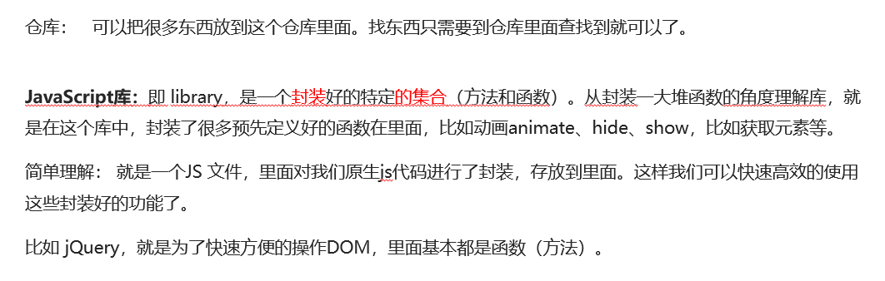

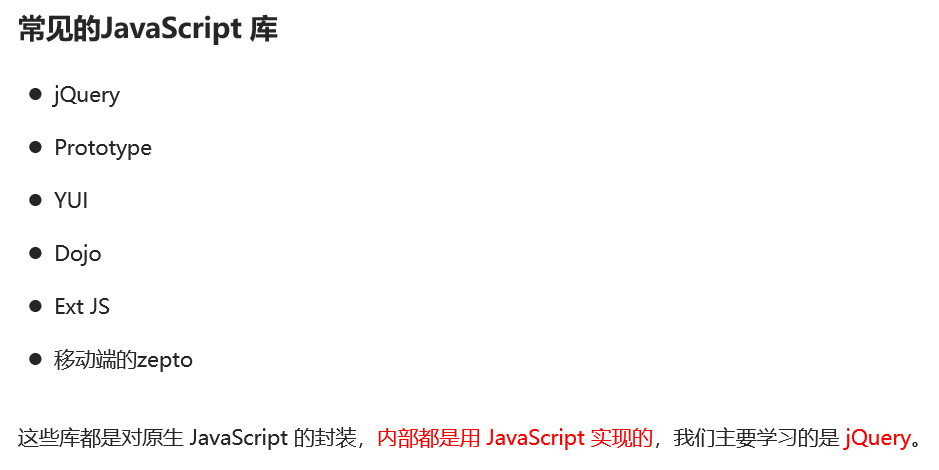

## **1.2 jQuery** **的概念**

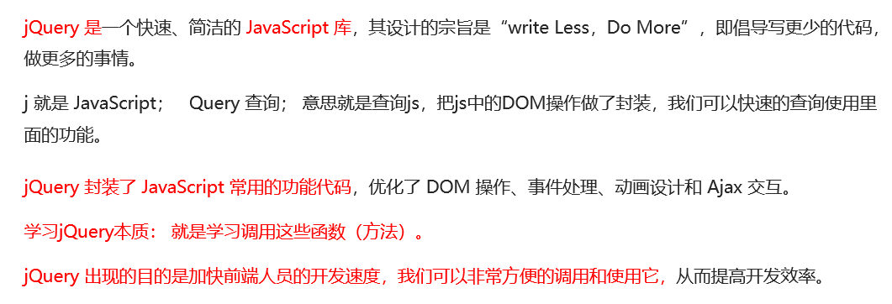

## **1.3 jQuery** **的优点**

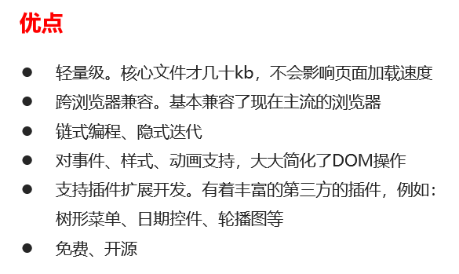

# 2. jQuery 的基本使用

## **2**.1  **jQuery** **的下载**

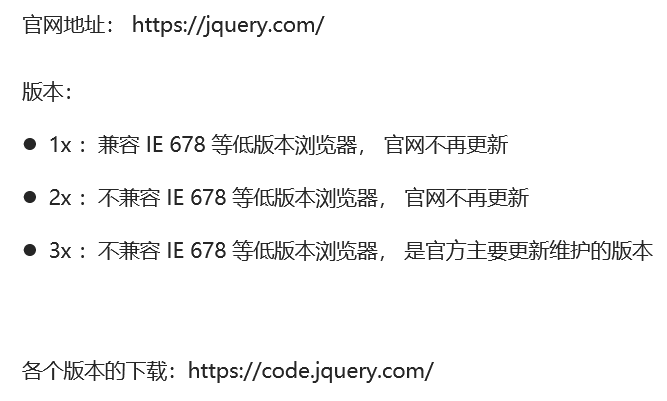

## **2**.2  **jQuery** **的使用步骤**

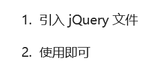

## **2**.3  **jQuery** **的入口函数(立即执行函数)**

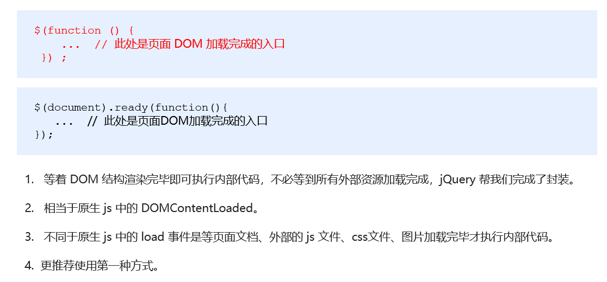

## **2**.4  **jQuery** **的顶级对象** **$**

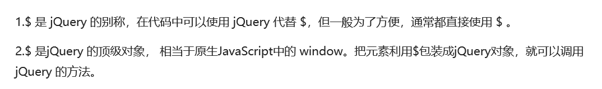

## **2**.5  **jQuery** **对象**和 **DOM** **对象**

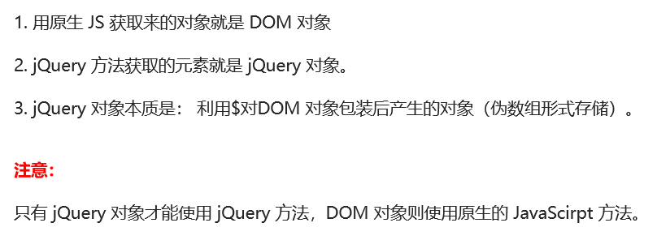

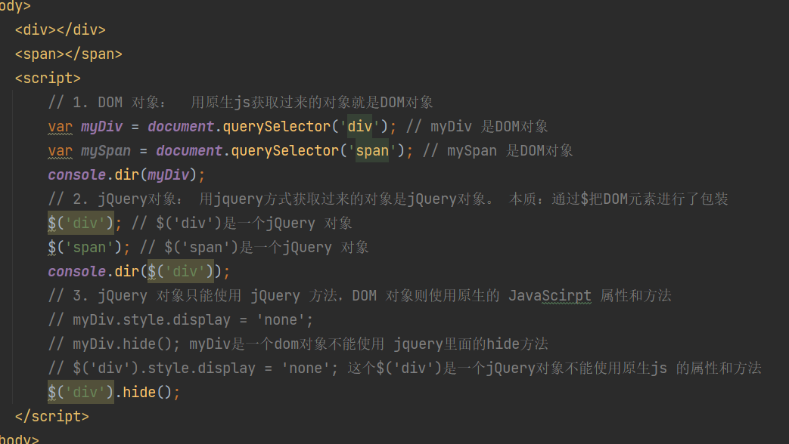

## **2**.6  **jQuery** **对象**和 **DOM** **对象 相互转换**

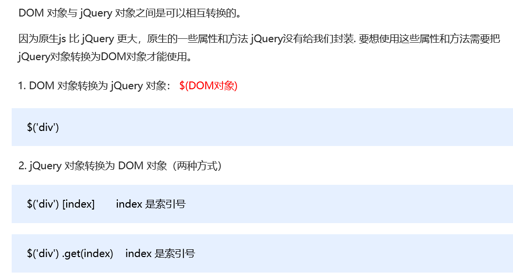

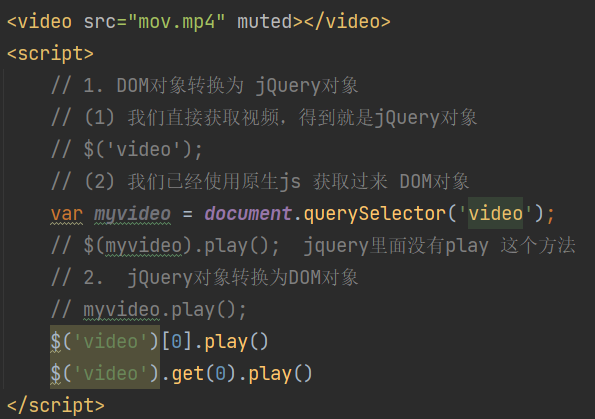