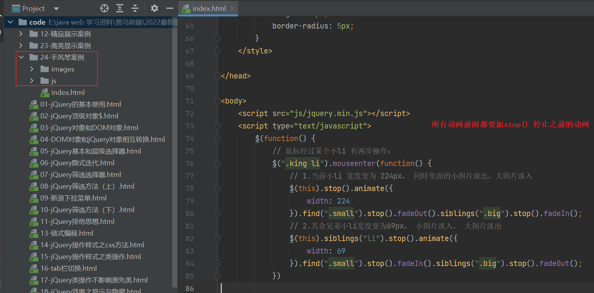
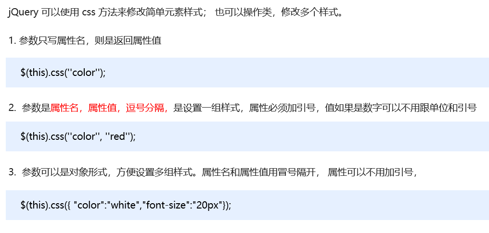
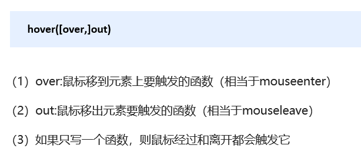
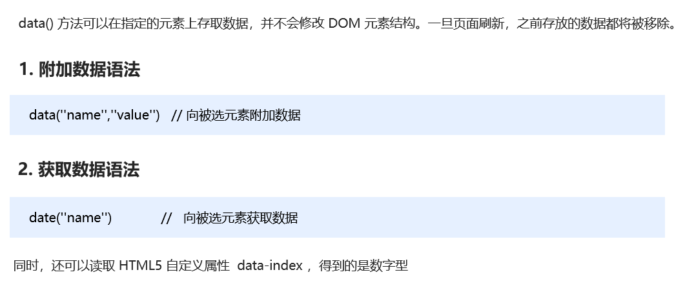

# jQuery 常用API 

# ==**1 **jQuery **选择器**==

## **1.1  **jQuery **基础选择器**

## **1**.2  **jQuery** **层级**选择器

## **1.3** **隐**式迭代（重要）

## **1.4** **jQuery** **筛选选择器**

## **1.5** **jQuery** 筛选方法（重点）

### 1.5.1 find()

### 1.5.2 siblings

### 1.5.3 parents()

## **1.6**  **jQuery** 里面的排他思想

## **1.7 **链式编程

# ==2 jQuery 样式操作==

## **2.1**  **操作** **css** **方法**

## **2.2**  **设置类样式方法**

## **2.3**  **类操作与className区别**

# ==3 jQuery 效果==

## **3.1**  **显示隐藏效果**

### 3.1.1 显示

### 3.1.2 隐藏

## 3.1.3 切换

## **3.2**  **滑动效果**

### 3.2.1 下滑

### 3.2.2 上滑

### 3.2.3 滑动切换

## **3.3**  **事件切换**

## **3.4**  **动画队列及其停止排队方法**

### 3.4.1 高亮显示案列

## **3.5**  **淡入淡出效果**

### 3.5.1  **淡入效果**

### 3.5.2  **淡出效果**

### 3.5.3  淡入淡出效果切换

### 3.5.4 将被选元素的不透明度逐渐地改变为指定的值

## **3.6**  **自定义动画** **animate**

# ==4 jQuery 属性操作==

## **4.1**  **设置或获取元素固有属性值** **prop()**

## 4.2  **设置或获取元素自定义属性值** **attr()**

## 4.3  **数据缓存** **data()**

# ==5 jQuery 内容文本值==

## 5.**1.** **普通元素内容** **html()**

## 5.2 **普通元素文本内容** **text()**  

## 5.3 **表单的值** val()

# ==6 jQuery 元素操作==

## 6.1 遍历元素

### 6.1.1  语法1

### 6.1.2  语法2

## 6.2 **创建**元素

## 6.3 添加元素

### 6.3.1 内部添加

### 6.3.2 外部添加

## 6.4 **删除**元素

# ==7 jQuery 尺寸、位置操作==

## **7.1**  **jQuery 尺寸**

## **7.2**  **jQuery 位置**

### 7.2.1 **offset**() **设置或获取元素偏移**

### 7.2.2 **position()** **获取元素偏移**

### 7.2.3 **scrollTop() / scrollLeft()** 

