# **jQuery** **事件**

# ==1 jQuery 事件注册==

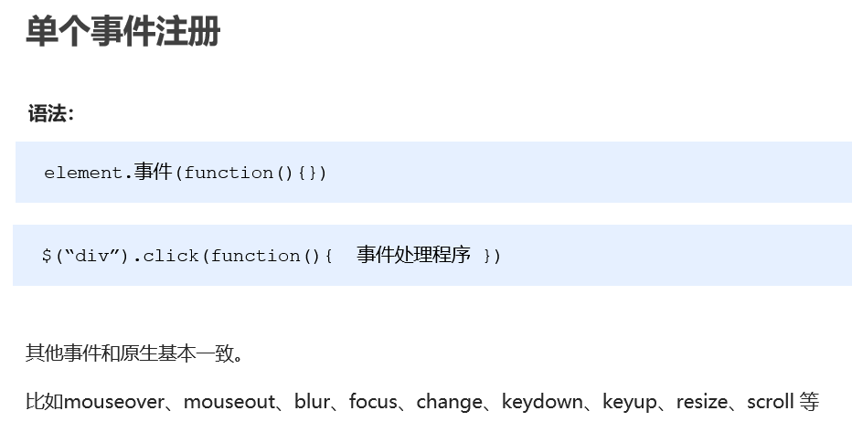

# ==2 jQuery 事件处理==

## **2.1** **事件处理** **on()** **绑定事件**

### 2.1.1 语法

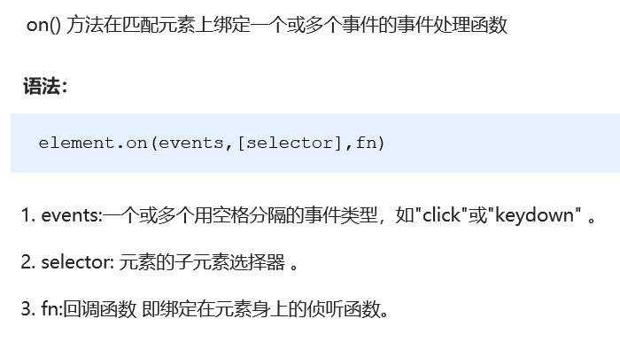

### 2.1.2 on() 方法优势1  ==绑定多个事件==

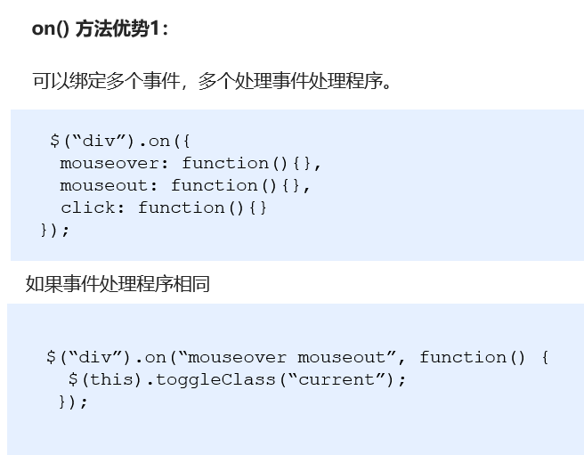

### 2.1.3 on() 方法优势2 ==事件委派==

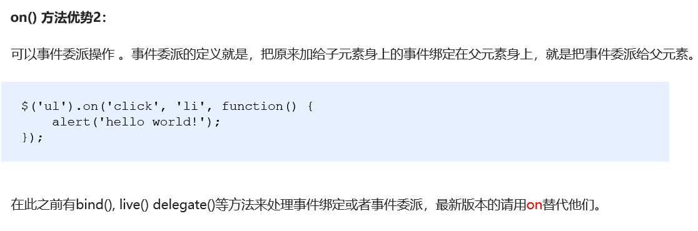

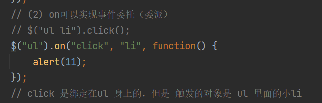

### 2.1.4 on() 方法优势3 ==给动态生成的元素绑定事件 (给未来的元素绑定事件)==

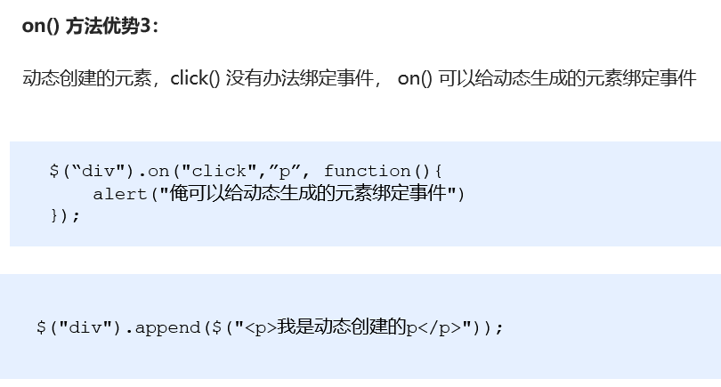

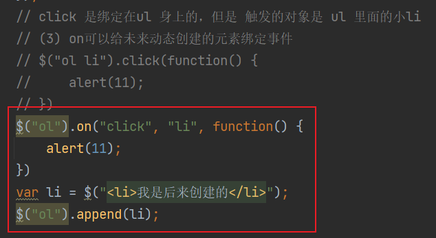

## **2.2** **事件处理** **off()** **解绑事件**

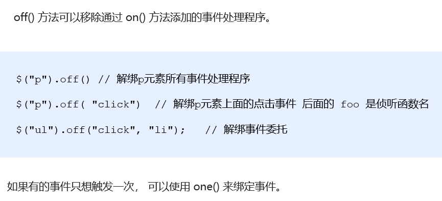

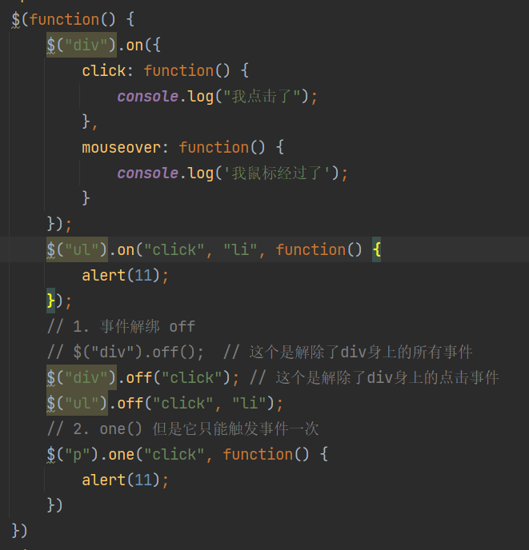

## **2.3** **自动触发事件 trigger()** 

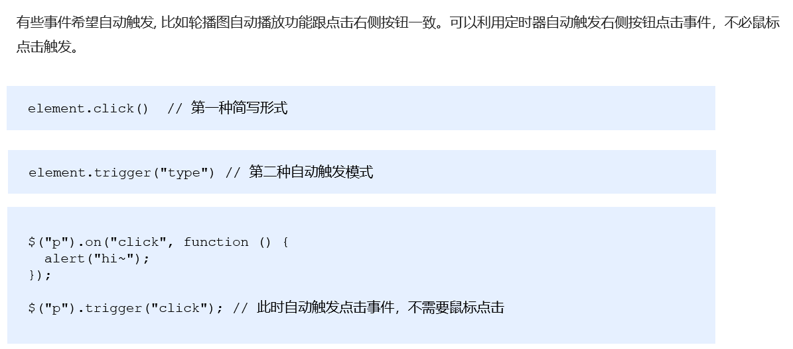

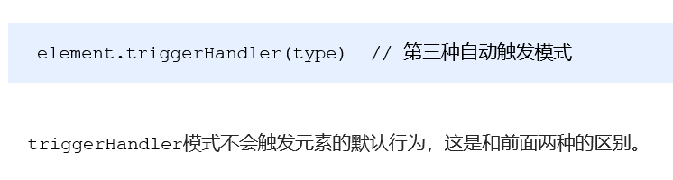

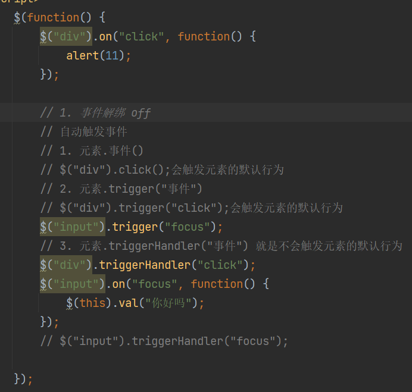

# ==3 jQuery 事件对象==

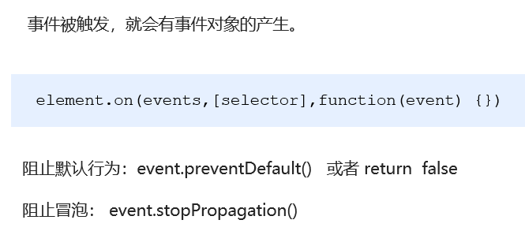

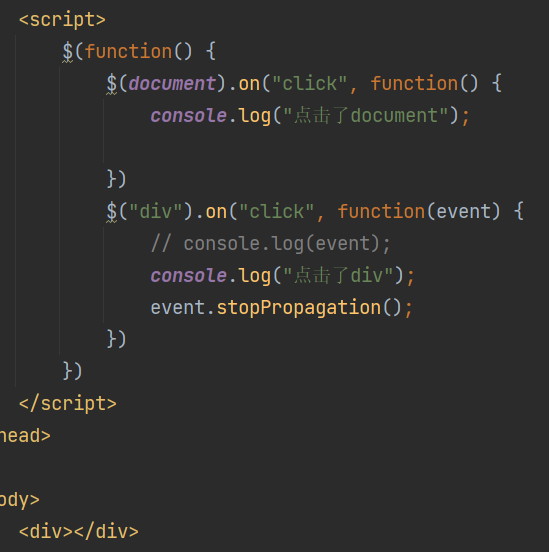