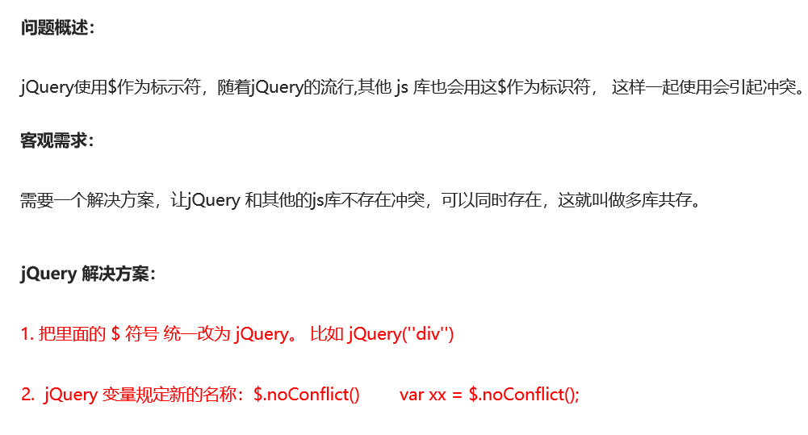

# jQuery其他方法	

# 1 jQuery 拷贝对象

# 2 多库共存

# 3 jQuery 插件

## 3.1 **jQuery** **插件常用的网站：**

1. jQuery 插件库 http://www.jq22.com/   

2. jQuery 之家  http://www.htmleaf.com/  (推荐使用 都是免费的)

## 3.2 **jQuery** **插件演示**

全屏滚动（fullpage.js）

   gitHub： https://github.com/alvarotrigo/fullPage.js

   中文翻译网站： http://www.dowebok.com/demo/2014/77/

## 3.3 **bootstrap JS** **插件**

