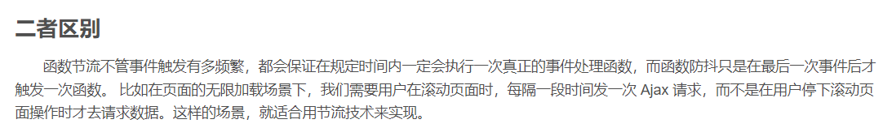

# **axios**


## 1.1 **直接使用**axios**发起请求**


### 1.1.2  直接使用axios发起GET请求


### 1.1.3  直接使用axios发起POST请求


## ==1.2 节流和防抖==


### 1.2.1 节流


第一种案列更容易理解


第二种案列

```javascript
<!DOCTYPE html>
<html lang="en">
<head>
  <meta charset="UTF-8">
  <meta name="viewport" content="width=device-width,initial-scale=1.0,maximum-scale=1.0,user-scalable=no">
  <meta http-equiv="X-UA-Compatible" content="ie=edge">
  <title>节流</title>
</head>
<body>

  <button id="throttle">点我节流！</button>

  <script>
    window.onload = function() {
      // 1、获取按钮，绑定点击事件
      var myThrottle = document.getElementById("throttle");
      myThrottle.addEventListener("click", throttle(sayThrottle));
    }

    // 2、节流函数体
    function throttle(fn) {
      // 4、通过闭包保存一个标记
      let canRun = true;
      return function() {
        // 5、在函数开头判断标志是否为 true，不为 true 则中断函数
        if(!canRun) {
          return;
        }
        // 6、将 canRun 设置为 false，防止执行之前再被执行
        canRun = false;
        // 7、定时器
        setTimeout( () => {
          fn.call(this, arguments);
          // 8、执行完事件（比如调用完接口）之后，重新将这个标志设置为 true
          canRun = true;
        }, 1000);
      };
    }

    // 3、需要节流的事件
    function sayThrottle() {
      console.log("节流成功！");
    }

  </script>
</body>
</html>

```


### 1.2.2 防抖


```javascript
<!DOCTYPE html>
<html lang="en">
<head>
  <meta charset="UTF-8">
  <meta name="viewport" content="width=device-width,initial-scale=1.0,maximum-scale=1.0,user-scalable=no">
  <meta http-equiv="X-UA-Compatible" content="ie=edge">
  <title>防抖</title>
</head>
<body>
<button id="debounce1">点我防抖！</button>

<script>
  window.onload = function() {
    // 1、获取这个按钮，并绑定事件
    var myDebounce = document.getElementById("debounce1");
    myDebounce.addEventListener("click", debounce(handle));
  }

  // 2、防抖功能函数，接受传参
  function debounce(fn) {
    // 4、创建一个标记用来存放定时器的返回值
    let timeout = null;
    return function() {
      // 5、每次当用户点击/输入的时候，把前一个定时器清除
      clearTimeout(timeout);
      // 6、然后创建一个新的 setTimeout，
      // 这样就能保证点击按钮后的 interval 间隔内
      // 如果用户还点击了的话，就不会执行 fn 函数
      timeout = setTimeout(() => {
        fn.call(this, arguments);
      }, 1000);
    };
  }

  // 3、需要进行防抖的事件处理
  function handle() {
    // 有些需要防抖的工作，在这里执行
    console.log("防抖成功！");
  }

</script>
</body>
</html>

```

### 1.2.3 区别和应用场景



