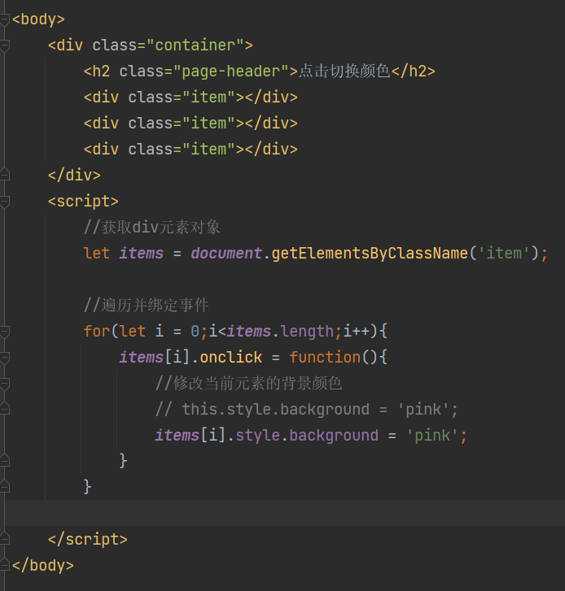
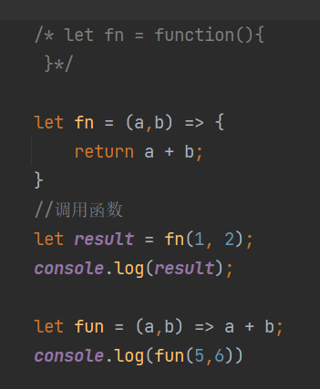
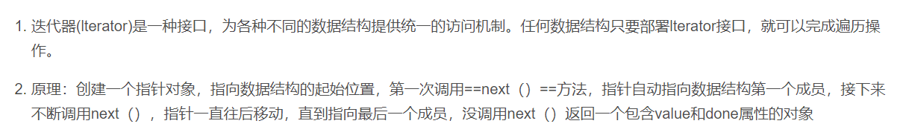
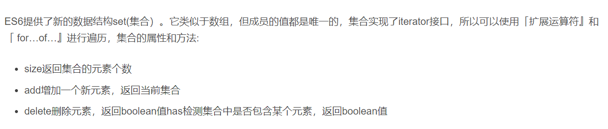
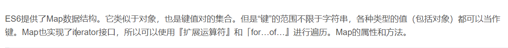
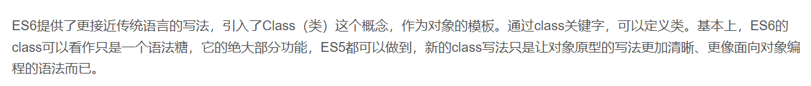
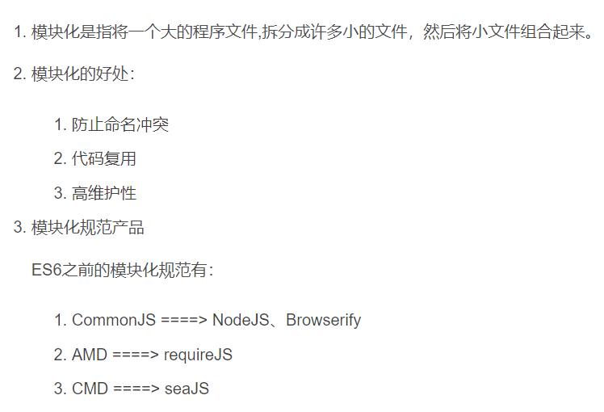
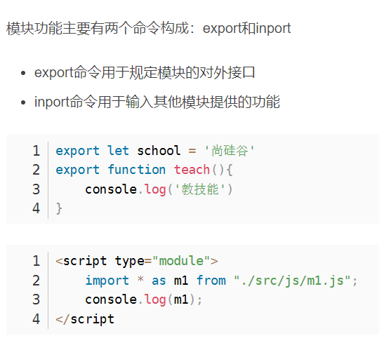
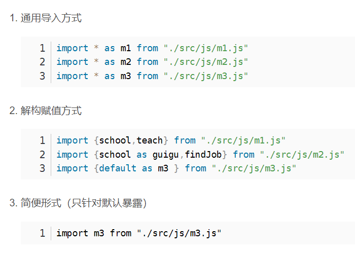
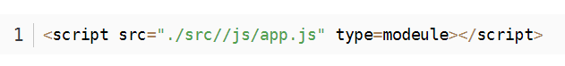

# 1. ES6

## 1.1 let和const命令

### 1.1.1 let

#### 1.1.1.1 特性

rdf变量不能重复声明

```js
let star='罗志祥';
let star='小猪'  //error
```

let有块级[作用域 ](https://so.csdn.net/so/search?q=作用域&spm=1001.2101.3001.7020) 不仅仅针对花括号，例如if（）里面

```js
{
    let girl='周扬青'
}
console.log(girl) //error
```

不存在变量提前

```js
console.log(song)   //error
let song='恋爱达人'
```

不影响作用域链

```js
let school='abc'
function fn(){
    console.log(school) //abc
}
```

#### 1.1.1.2 案列 



### 1.1.2 const

#### 1.1.2.1 特性

声明常量

```js
const A = 'abc'
```

1. 一定要赋初始值

2. 一般常量使用大写（潜规则）

3. 常量的值不能修改

4. 也具有块级作用域

   ```js
   {
       const pyaler = 'uzi'
   }
   console.log(player) //error
   ```

5. 对于数组和对象的元素修改，不算作对常量的修改

   ```js
   //3. 常量的值不能修改
    A = 'ATGUIGU'; //error
   //对于数组和对象的元素修改，不算作对常量的修改
   const team = ['uzi','MXLG','Ming','Letme'];
   team.push('Meiko'); //不报错，常量地址没有发生变化
   ```

## 1.2 解构赋值

### 1.2.1 介绍

ES6 允许按照一定模式从数组和对象中提取值，对变量进行赋值，这被称为解构赋值。

#### 1.2.1.1 数组的解构

```js
const F4 = ['小沈阳'，'刘能','赵四','宋小宝']
let [xiao,liu,zhao,song] = F4; 
console.log(xiao)
console.log(liu)
console.log(zhao)
console.log(song)
```

#### 1.2.1. 2 对象的解构

```
const zhao = {
    name : '赵本山'，
    age: '不详',
    xiaopin: function(){
        console.log("我可以演小品")
    }
}
let {name,age,xiaopin} = zhao;
console.log(name);
console.log(age);
console.log(xiaopin);
```

## ==1.3 模板字符串(字符串拼接)==

### 1.3.1 声明

```js
let str = `我也是一个字符串`
console.log(str,typeof str);
```

### 1.3.2 内容中可以直接出现换行符

```js
let str = `<ul>
			<li>RHF</li>
			<li>RHF</li>
		   </ul>`；
```

### 1.3.3 变量拼接

```js
let lovest = 'RHF';
let out = `${lovest}是最帅的`;
console.log(out)  //RHF是最帅的
```

## 1.4 对象的简化写法

### 1.4.1 介绍

ES6允许在大括号里面，直接写入变量和函数，作为对象的属性和方法,这样的书写更加简洁

### 1.4.2 特性

```
let name = 'aaa';
let change = function(){
    console.log('aaa');
}

const school = {
    name,
    change,
    improve(){
        consolg.log('bbb');
    }
}
```

## 1.5 箭头函数

### 1.5.1 介绍

ES6允许使用箭头（=>）定义函数



### 1.5.2 特性

#### 1.5.2.1 this是静态的，this始终指向函数声明时所在作用域下的this的值

```
function A(){
    console.log(this.name)
}

let B = () => {
    console.log(this.name);
}

window.name = '尚硅谷';
const school = {
    name: 'ATGUIGU'
}

//直接调用
A()   //尚硅谷
B()  //尚硅谷

//call
A.call(school); //ATGUIGU
B.cal(school);  //尚硅谷
```

#### 1.5.2.2 不能作为构造实例化对象

```
let A(name,age) => {
    this.name=name;
    this.age=age;
}
let me = new A('xiao',123);
console.me //error
```

#### 1.5.2.3 不能使用arguments变量

```js
let fn = () => {
    console.log(arguments)；
}
fn(1,2,3)  //error
```

#### 1.5.2.4 简写

1. 省略小括号，当形参有且只有一个的时候

```js
let add = n => {
    return n + 1;
}
123
```

2. 省略花括号，当代码体只有一条语句的时候，此时return也必须省略

```js
let add = n => n+1;
```

## 1.6 函数参数默认值

### 1.6.1 介绍

ES6允许给函数参数赋值初始值

### 1.6.2 特性

#### 1.6.2.1 可以给形参赋初始值，一般位置要靠后（潜规则）

```js
function add(a,b,c=12){
    return a+b+c; 
}
let result = add (1,2);
console.log(result) // 15
```

#### 16.2.2 与解构赋值结合

```
function A({host='127.0.0.1',username,password,port}){
    console.log(host+username+password+port)
}
A({
    username:'ran',
    password:'123456',
    port:3306
})
```

## 1.7 rest参数

### 1.7.1 介绍

ES6引入rest参数，用于获取函数的实参，用来代替arguments

### 1.7.2 特性

```js
function date(...args){
    console.log(args);
}
date('aaa','bbb','ccc')；
```

## 1.8 扩展运算符

### 1.8.1 介绍

扩展运算符是能将数组转换为逗号分隔的参数序列

### 1.8.2 特性

```js
const tfboys=['AA','BB','CC']
function chunwan(){
    console.log(arguments);
}
chunwan(...tfboys);  //0:'AA' 1:'BB' 2:'CC'
```

### 1.8.3 应用

#### 1.8.3.2 数组的合并

```js
const A = ['aa','bb'];
const B = ['cc','dd'];
const C = [...A,...B];
console.log(C)   //[aa,bb,cc,dd]
```

#### 1.8.3.3 数组的克隆

```js
const A = ['a','b','c'];
const B = [...A];
console.log(B)   //[a,b,c]
```

#### 1.8.3.4 将伪数组转换为真正的数组

```js
const A = documents.querySelectorAll('div');
const B = [...A];
console.log(B) // [div,div,div]
```

## 1.9 Symbol

### 1.9.1 介绍

ES6引入了一种新的原始数据类型 Symbol，表示独一无二的值。它是JavaScript语言的第七种数据类型，是一种类似于字符串的数据类型。

Symbol特点：

Symbol的值是唯一的，用来解决命名冲突的问题
Symbol值不能与其他数据进行运算
Symbol定义的对象属性不能使用for…in循环遍历，但是可以使用Reflect.ownKeys来获取对象的所有键名

### 1.9.2 特性

#### 1.9.2.1 创建

```
let s = Symbol('aa');
let s2= Symbol('aa');
console.log(s===s2)   //false

let s3 = Symbol.for('bb');
let s4 = Symbol.for('bb');
comsole.log(s3===s4) ///true
```

#### 1.9.2.2 不能与其他数据进行运算

```js
let result = s + 100  //error
let result = s > 100  //error
let result = s + s  //error
```

#### 1.9.2.3 Symbol内置值

```
class Person {
    static [Symbol.hasInstance](param){
        console.log(param);
        console.log("我被用来检测了")；
        return false;
    }
}
let o = {};
console.log(o instanceof Person); //我被用来检测了，false
```

### 1.9.3 应用

#### 1.9.3.1 给对象添加方法方式一：

```
let game = {
    name : 'ran'
}
let methods = {
    up:Symbol()
    down:Symbol()
}
game[methods.up]=function(){
    console.log('aaa');
}
game[methods.down]=function(){
    console.log('bbb');
}
console.log(game)    // name: 'ran',Symbol(),Symbol()
```

#### 1.9.3.2 给对象添加方法方式二

```
let youxi = {
    name: '狼人杀'，
    [Symbol('say')]:function(){
        console.log('阿萨德')
    }
}
console.log(youxi)    // name:'狼人杀',Symbol(say)
```

## 1.10 迭代器

### 1.10.1 介绍



### 1.10.2 特性

```
const xiyou=['AA','BB','CC','DD'];
// for(let v of xiyou){
//     console.log(v)  // 'AA','BB','CC','DD'  //for in保存的是键名，for of保存的是键值
// }
let iterator = xiyou[Symbol.iterator]();
console.log(iterator.next()); //{{value:'唐僧'，done:false}}
console.log(iterator.next()); //{{value:'孙悟空'，done:false}}
```

### 1.10.3 应用

```
const banji = {
    name : "终极一班",
    stus: [
        'aa',
        'bb',
        'cc',
        'dd'
    ],
    [Symbol.iterator](){
        let index = 0;
        let _this = this;
        return {
            next: () => {
                if(index < this.stus.length){
                    const result = {value: _this.stus[index],done: false};
                    //下标自增
                    index++;
                    //返回结果
                    return result;
                }else {
                    return {value: underfined,done:true};
                }
            }
        }
    }
}
for(let v of banji){
    console.log(v);  // aa bb cc dd
}
```

## 1.11 生成器

### 1.11.1 介绍

生成器函数是ES6提供的一种异步编程解决方案，语法行为与传统函数完全不同，是一种特殊的函数

### 1.11.2 特性

```
function * gen (){    //函数名和function中间有一个 * 
    yield '耳朵'；     //yield是函数代码的分隔符
    yield '尾巴'；
    yield '真奇怪'；
}
let iterator = gen();
console.log(iteretor.next()); 
//{value:'耳朵',done:false} next（）执行第一段，并且返回yield后面的值
console.log(iteretor.next()); //{value:'尾巴',done:false}
console.log(iteretor.next()); //{value:'真奇怪',done:false}
```

### 1.11.3 应用

#### 1.11.3.1 生成器函数的参数传递

```
function * gen(args){
    console.log(args);
    let one = yield 111;
    console.log(one);
    let two = yield 222;
    console.log(two);
    let three = yield 333;
    console.log(three);
}

let iterator = gen('AAA');
console.log(iterator.next());
console.log(iterator.next('BBB'));  //next中传入的BBB将作为yield 111的返回结果
console.log(iterator.next('CCC'));  //next中传入的CCC将作为yield 222的返回结果
console.log(iterator.next('DDD'));  //next中传入的DDD将作为yield 333的返回结果
```

#### 1.11.3.2 实例1：用生成器函数的方式解决回调地狱问题

```
function one(){
    setTimeout(()=>{
        console.log('111')
        iterator.next()
    },1000)
}
function two(){
    setTimeout(()=>{
        console.log('222')
        iterator.next();
    },2000)
}
function three(){
    setTimeout(()=>{
        console.log('333')
        iterator.next();
    },3000)
}

function * gen(){
    yield one();
    yield two();
    yield three();
}

let iterator = gen();
iterator.next();
```

#### 1.11.3.3 实例2：模拟异步获取数据

```
function one(){
    setTimeout(()=>{
        let data='用户数据';
        iterator.next(data)
    },1000)
}
function two(){
    setTimeout(()=>{
        let data='订单数据';
        iterator.next(data)
    },2000)
}
function three(){
    setTimeout(()=>{
        let data='商品数据';
        iterator.next(data)
    },3000)
}

function * gen(){
    let users=yield one();
    console.log(users)
    let orders=yield two();
    console.log(orders)
    let goods=yield three();
    console.log(goods)
}

let iterator = gen();
iterator.next();
```

## 1.12 Promise

### 1.12.1 介绍

Promise是ES6引入的异步编程的新解决方案。语法上 Promise是一个构造函数，用来封装异步操作并可以获取其成功或失败的结果。

### 1.12.2 特性

#### 1.12.2.1 基本特性

```
<script>
    const p =new Promise((resolve, reject)=>{
        setTimeout(()=>{
            let data='数据库数据'
            // resolve(data);
            reject(data);
        })
    })

    p.then(function (value){         //成功则执行第一个回调函数，失败则执行第二个
        console.log(value)
    },function (reason){
        console.error(reason)
    })
</script>
```

#### 1.12.2.2 Promise.then（）方法

```
<script>
    const p =new Promise((resolve, reject) =>{
        setTimeout(()=>{
            resolve('用户数据');
        })
    });

//then（）函数返回的实际也是一个Promise对象
//1.当回调后，返回的是非Promise类型的属性时，状态为fulfilled，then（）函数的返回值为对象的成功值，如reutnr 123，返回的Promise对象值为123，如果没有返回值，是undefined

//2.当回调后，返回的是Promise类型的对象时，then（）函数的返回值为这个Promise对象的状态值

//3.当回调后，如果抛出的异常，则then（）函数的返回值状态也是rejected
    let result = p.then(value => {
        console.log(value)
        // return 123;
        // return new Promise((resolve, reject) => {
        //     resolve('ok')
        // })
        throw 123
    },reason => {
        console.log(reason)
    })
    console.log(result);
</script>
```

#### 1.12.2.3 Promise.catch（）方法

```
//catch（）函数只有一个回调函数，意味着如果Promise对象状态为失败就会调用catch（）方法并且调用回调函数
<script>
    const p = new Promise((resolve, reject) => {
        setTimeout(()=>{
            reject('出错啦')
        },1000)
    })

    p.catch(reason => {
        console.log(reason)
    })
</script>
```

#### 1.12.2.4 应用：发送AJAX请求

```
<script>
    //ajax请求返回一个promise
    function sendAjax(url){
        return new Promise((resolve, reject) => {

            //创建对象
            const x =new XMLHttpRequest();

            //初始化
            x.open('GET',url);

            //发送
            x.send();

            //时间绑定
            x.onreadystatechange = ()=>{
                if(x.readyState === 4 ){
                    if(x.status >= 200 && x.status < 300){
                        //成功
                        resolve(x.response)
                    }else {
                        //失败
                        reject(x.status)
                    }
                }
            }
        })
    }

    //测试
    sendAjax("https://api.apiopen.top/getJoke").then(value => {
        console.log(value)
    },reason => {
		console.log(reason)
    })

</script>
```

## 1.13 集合

### 1.13.1 Set

#### 1.13.1.1 介绍



#### 1.13.1.2 特性

```
<script>
    let s = new Set();
    let s2 = new Set(['A','B','C','D'])

    //元素个数
    console.log(s2.size);

    //添加新的元素
    s2.add('E');

    //删除元素
    s2.delete('A')

    //检测
    console.log(s2.has('C'));

    //清空
    s2.clear()

    console.log(s2);
</script>
```

#### 1.13.1.3  应用

```
<script>
    let arr = [1,2,3,4,5,4,3,2,1]

    //1.数组去重
    let result = [...new Set(arr)]
    console.log(result);
    //2.交集
    let arr2=[4,5,6,5,6]
    let result2 = [...new Set(arr)].filter(item => new Set(arr2).has(item))
    console.log(result2);
    //3.并集
    let result3=[new Set([...arr,...arr2])]
    console.log(result3);
    //4.差集
    let result4= [...new Set(arr)].filter(item => !(new Set(arr2).has(item)))
    console.log(result4);

</script>
```

### 1.13.2 Map

#### 1.13.2.1 介绍



#### 1.13.2.2 特性

```
<script>
    let m = new Map();
    m.set('name','ran');
    m.set('change',()=>{
        console.log('改变！')
    })
    let key={
        school:'atguigu'
    }
    m.set(key,['成都','西安']);

    //size
    console.log(m.size);

    //删除
    m.delete('name');

    //获取
    console.log(m.get('change'));

    // //清空
    // m.clear()

    //遍历
    for(let v of m){
        console.log(v);
    }
</script>
```

## 1.14 Class

### 1.14.1 初体验

#### 1.14.1.1 介绍



#### 1.14.1.2 特性

```
<script>
    class shouji {
        constructor(brand,price) {
            this.brand=brand;
            this.price=price
        }

        call(){
            console.log('我可以打电话')
        }
    }

    let A = new shouji('1+',1999);
    console.log(A)
</script>
```

### 1.14.2 静态成员

```
<script>
  class Person{
      static name='手机'
  }
  let nokia = new Person();
  console.log(nokia.name);
</script>
```

### 1.14.3 构造函数继承

```
<script>
  function Phone(brand,price){
      this.brand=brand;
      this.price=price;
  }
  Phone.prototype.call=function (){
      console.log("我可以打电话");
  }
  function SmartPhone(brand,price,color,size){
      Phone.call(this,brand,price);
      this.color=color;
      this.size=size;
  }

  //设置子级构造函数原型
  SmartPhone.prototype=new Phone;
  SmartPhone.prototype.constructor=SmartPhone;

  //声明子类方法
  SmartPhone.prototype.photo = function (){
      console.log('我可以玩游戏');
  }
  const chuizi = new SmartPhone('锤子',2499,'黑色','5.5inch')
  console.log(chuizi);
</script>
```

### 1.14.4 Class的类继承

```
<script>
    class Phone{
        constructor(brand,price) {
            this.brand=brand;
            this.price=price;

        }
        //父类的成员属性
        call(){
            console.log('我可以打电话')
        }
    }
    class SmartPhone extends Phone{
        constructor(brand,price,color,size) {
            super(brand,price);
            this.color=color;
            this.size=size;
        }
        photo(){
            console.log('拍照');
        }

        playGame(){
            console.log('打游戏');
        }
    }
    const xiaomi=new SmartPhone('小米',1999,'黑色','4.7inch')
    xiaomi.call();
    xiaomi.photo();
    xiaomi.playGame();
</script>
```

### 1.14.5 子类对父类方法的重写

```
<script>
    class Phone{
        constructor(brand,price) {
            this.brand=brand;
            this.price=price;

        }
        //父类的成员属性
        call(){
            console.log('我可以打电话')
        }
    }
    class SmartPhone extends Phone{
        constructor(brand,price,color,size) {
            super(brand,price);
            this.color=color;
            this.size=size;
        }
        photo(){
            console.log('拍照');
        }

        playGame(){
            console.log('打游戏');
        }

        //重写！
        call(){
            console.log('我可以进行视频通话')
        }
    }
    const xiaomi=new SmartPhone('小米',1999,'黑色','4.7inch')
    xiaomi.call();
    xiaomi.photo();
    xiaomi.playGame();
</script>
```

### 1.14.6 get和set设置

```
<script>
  class Phone{
      get price(){
          console.log("价格被读取了")
          return 'I LOVE YOU'
      }

      set price(val){
          console.log('价格被修改了')
          return val;
      }
  }

    //实例化对象
    let s = new Phone();
    s.price=12  
    // console.log(s.price)   //其实是调用price方法
</script>
```

## 1.15 数值扩展

```
<script>
   // Number.EPSILON是 JavaScript的最小精度，属性的值接近于 2.22044...E-16
   function equal(a,b){
       if(Math.abs(a-b) < Number.EPSILON){
           return true;
       }else {
           return false;
       }
   }

   console.log(equal(0.1 + 0.2 === 0.3))  //false
   console.log(equal(0.1+0.2,0.3))  //true

   //二进制和八进制
   let b = 0b1010; //2进制
   let o = 0o777;  //8进制
   let d = 100;    //10进制
   let x = 0xff;   //16进制
   console.log(x)   //255

   //检测一个数是否为有限数
   console.log(Number.isFinite(100));  //true
   console.log(Number.isFinite(100/0));  //false
   console.log(Number.isFinite(Infinity));  //false

   //检测一个数值是否为NaN
   console.log(Number.isNaN(123))  //false

   //字符串转整数
   console.log(Number.parseInt('5213123love')); //5213123
   console.log(Number.parseFloat('5.123123神器')); //5.123123

   //判断是否为整数
   console.log(Number.isInteger(5));  //true
   console.log(Number.isInteger(2.5)); //false
   
   //将小数部分抹除
   console.log(Math.trunc(3.45345345345)) //3

   //检测一个数到底是正数、负数、还是0
   console.log(Math.sign(100)) //1
   console.log(Math.sign(0))  //0
   console.log(Math.sign(-123)) //-1
</script>
```

## 1.16 对象方法扩展

```
<script>
    //1.Object.is 判断两个值是否完全相等
    console.log(Object.is(120,120))  //true
	console.log(Object.is(NaN,NaN))  //false

    //2.Object.assign 对象的合并
    const a = {
        name:'ran',
        age:12
    }
    const b = {
        pass:'i love you'
    }
    console.log(Object.assign(a,b))   //{name:'ran',age:'12',pass:'i love you'}

    //3.Object.setPrototypeOf 设置原型对象 Object.getPrototypeof
    const school = {
        name:'尚硅谷'
    }
    const cities = {
        xiaoqu:['北京','上海']
    }
    Object.setPrototypeOf(school,cities)
    console.log(Object.getPrototypeOf(school))  //{xiaoqu: Array(2)}
    console.log(school)  //{name: "尚硅谷"}
</script>
```

## 1.17 模块化

### 1.17.1 基本介绍

#### 1.17.1.1 介绍



#### 1.17.1.2 语法



### 1.17.2 暴露语法汇总

#### 1.17.2.1 统一暴露

```js
//统一暴露
let school = '尚硅谷';
function findjob(){
    console.log('找工作吧');
}
//export {school,findjob}
```

#### 1.17.2.2 默认暴露

```js
//默认暴露
export default {
    school:'ATGUIGU',
    change:function(){
        console.log('我们可以改变你')
    }
}
```

### 1.17.3 引入语法汇总



### 1.17.4 模块化方式2

