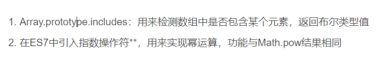
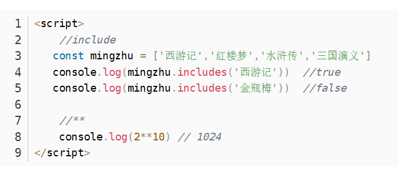
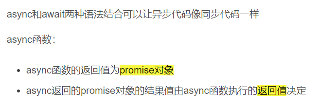
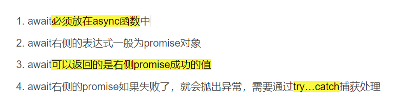
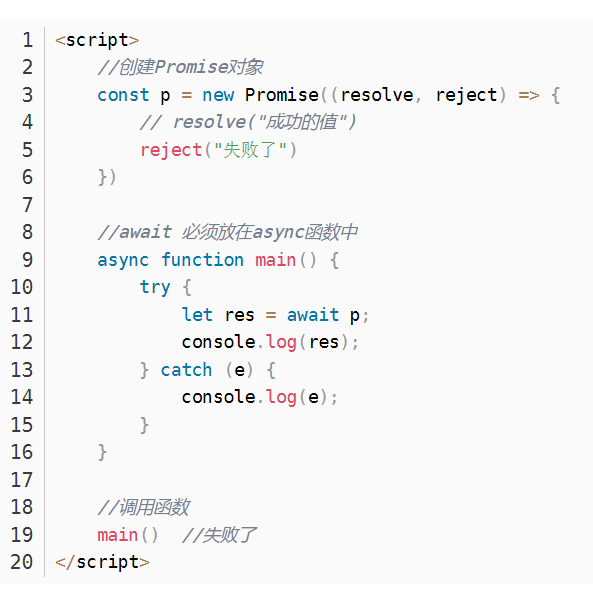
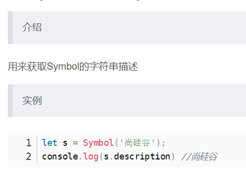

# ES7-ES11

# 1. ES7

## 1.1 介绍



## 1.2 应用



# 2. ES8

## 2.1 async函数

### 2.1.1 介绍



### 2.1.2 特性

```
async function fn(){
   //1.如果返回的是一个非Promise的对象，则fn（）返回的结果就是成功状态的Promise对象，值为返回值
   //2.如果返回的是一个Promise对象，则fn（）返回的结果与内部Promise对象的结果一致
   //3.如果返回的是抛出错误，则fn（）返回的就是失败状态的Promise对象
   return new Promise((resolve,reject)=>{
       resolve('成功的数据');
   });
}
const result = fn();
result.then(value=>{
   console.log(value)  //成功的数据
},reason=>{
   console.log(reason)
})
```

## 2.2 await表达式

### 2.2.1 介绍



### 2.2.2 特性



### 2.2.3 应用：发送AJAX请求

```
<script>
    //ajax请求返回一个promise
    function sendAjax(url){
        return new Promise((resolve, reject) => {

            //创建对象
            const x =new XMLHttpRequest();

            //初始化
            x.open('GET',url);

            //发送
            x.send();

            //时间绑定
            x.onreadystatechange = ()=>{
                if(x.readyState === 4 ){
                    if(x.status >= 200 && x.status < 300){
                        //成功
                        resolve(x.response)
                    }else {
                        //失败
                        reject(x.status)
                    }
                }
            }
        })
    }

   //async 与 await 测试
    async function main(){
        let result = await sendAjax("https://api.apiopen.top/getJoke")
        console.log(result);
    }
    main()

</script>
```

## 2.3 ES8对象方法扩展

```
<script>
    const school = {
        name:'尚硅谷',
        cities:['北京','上海','深圳'],
        xueke:['前端','Java','大数据','运维']
    };

    //获取对象所有的键
    console.log(Object.keys(school));

    //获取对象所有的值
    console.log(Object.values(school));

    //entries,用来创建map
    console.log(Object.entries(school));
    console.log(new Map(Object.entries(school)))

    //对象属性的描述对象
    console.log(Object.getOwnPropertyDescriptor(school))
    
    const obj = Object.create(null,{
        name:{
            value:'尚硅谷',
            //属性特性
            writable:true,
            configurable:true,
            enumerable:true,
        }
    })
</script>
```

# 3. ES9

## 3.1 运算扩展符与rest参数

```
<script>
    function connect({host,port,...user}){
        console.log(host);
        console.log(port);
        console.log(user)
    }
    connect({
        host:'127.0.0.1',
        port:3306,
        username:'root',
        password:'root',
        type:'master'
    })  //127.0.0.1  3306  {username: "root", password: "root", type: "master"}

</script>
```

```
<script>
    const AA={
        username:'ran'
    }
    const BB={
        password:'lyyrhf'
    }
    const CC={
        job:'Java'
    }
    const D={...AA,...BB,...CC};
    console.log(D) //{username: "ran", password: "lyyrhf", job: "Java"}
</script>
```

# 4. ES10

## 4.1 对象扩展方法

```
<script>
   //二维数组
   const res = Object.fromEntries([
       ['name','RHF'],
       ['cities','成都','武汉']
   ])
   console.log(res) //{name: "RHF", cities: "成都"}

   //Map
   const m = new Map();
   m.set('name','ranhaifeng')
   const result = Object.fromEntries(m)
   console.log(result); //{name: "ranhaifeng"}
</script>
```

## 4.2 字符串扩展方法

```
<script>
   //trim
   let str= ' asd  '
   console.log(str) //asd
   console.log(str.trimStart()) //asd  清空头空格
   console.log(str.trimEnd()) //  asd  清空尾空格
</script>
```

## 4.3 flat与flatMap

```
<script>
    const arr = [1,2,3,[4,5,6,[7,8,9]]]
    //参数为深度，是一个数字
    console.log(arr.flat(2)) //[1,2,3,4,5,6,7,8,9]

	const arr2=[1,2,3,4]
    const result = arr2.flatmap(item => [item * 10]); //如果map的结果是一个多维数组可以进行flat 是两个操作的结合
	
</script>
```

## 4.4 Symbol的description



## 4.5 私有属性

```
<script>
    class Person {
        //公有属性
        name;
        //私有属性
        #age;
        #weight;

        //构造方法
        constructor(name, age, weight) {
            this.name = name;
            this.#age = age;
            this.#weight = weight;
        }
        intro(){
            console.log(this.name);
            console.log(this.#age);
            console.log(this.#weight);
        }
    }

    //实例化
    const girl = new Person('陈', 18, '45kg');
    console.log(girl.#age) //error
    console.log(girl); //Person{name: "陈", #age: 18, #weight: "45kg"}
    girl.intro(); // 陈 18  45kg
</script>
```

## 4.6 Promise

```
<script>
    //声明两个promise对象
    const p1 = new Promise((resolve, reject) => {
        setTimeout(()=>{
            resolve('商品数据-1')
        },1000)
    })

    const p2 = new Promise((resolve, reject) => {
        setTimeout(()=>{
            reject('出错了！')
        },1000)
    })

    //调用allsettled方法:返回的结果始终是一个成功的，并且异步任务的结果和状态都存在
    const res = Promise.allSettled([p1,p2]);
    console.log(res)

    // Promise {<pending>}
    //     __proto__: Promise
    //     [[PromiseState]]: "fulfilled"
    //     [[PromiseResult]]: Array(2)

    //调用all方法：返回的结果是按照p1、p2的状态来的，如果都成功，则成功，如果一个失败，则失败，失败的结果是失败的Promise的结果
    const result = Promise.all([p1,p2])
    console.log(result)

</script>
```

## 4.7 可选链操作符

```
//相当于一个判断符，如果前面的有，就进入下一层级
function main(config){
    const dbHost = config?.db?.host
    console.log(dbHost) //192.168.1.100
}

main({
    db:{
        host:'192.168.1.100',
        username:'root'
    },
    cache：{
    	host:'192.168.1.200',
    	username:'admin'
	}
})
```

## 4.8 动态import

```
btn.onclick = function(){
    //使用之前并未引入，动态引入，返回的其实是一个Promise对象
    import('./hello.js').then(module=>{
        module.hello();
    })
}
```

## 4.9 BigInt类型

```
//大整型
let n = 521n;
console.log(n,typeof(n))  // 521n  n 

//函数
let n = 123;
console.log(BigInt(n)) // 123n  //不要使用浮点型，只能用int

//大数值运算
let max = Number.MAX_SAFE_INTEGER; // 9007199254740991
console.log(max +1) // 9007199254740992
console.log(max +2) // 9007199254740992 出问题了
console.log(BigInt(max)+BigInt(1)) 9007199254740992n
console.log(BigInt(max)+BigInt(2)) 9007199254740993n
```

## 5.10 绝对全局对象globalThis

```
console.log(globalThis) //window  //适用于复杂环境下直接操作window
```

